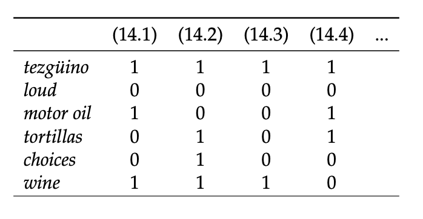
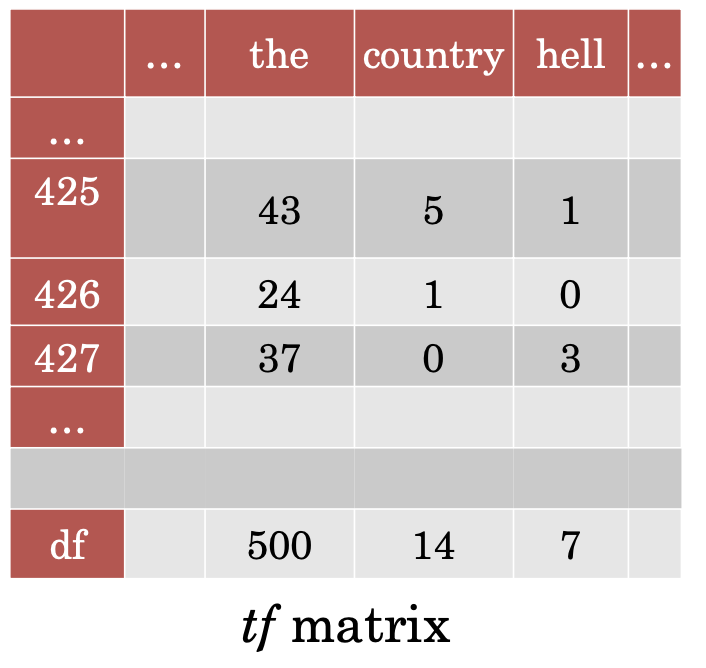
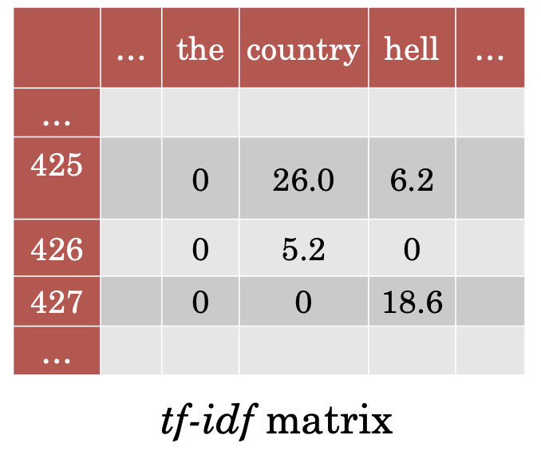
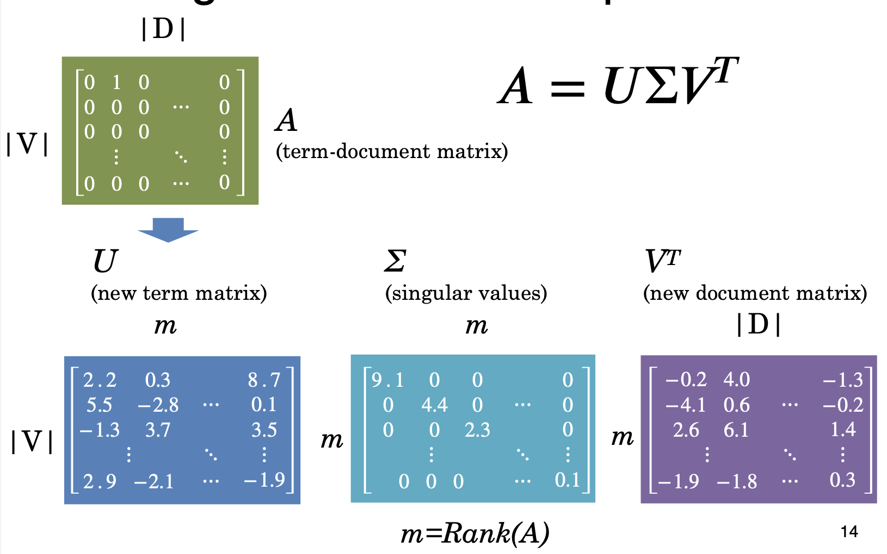
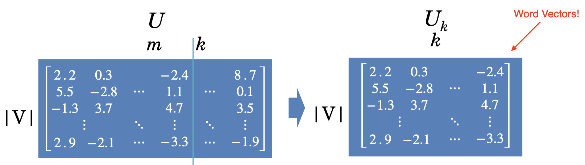
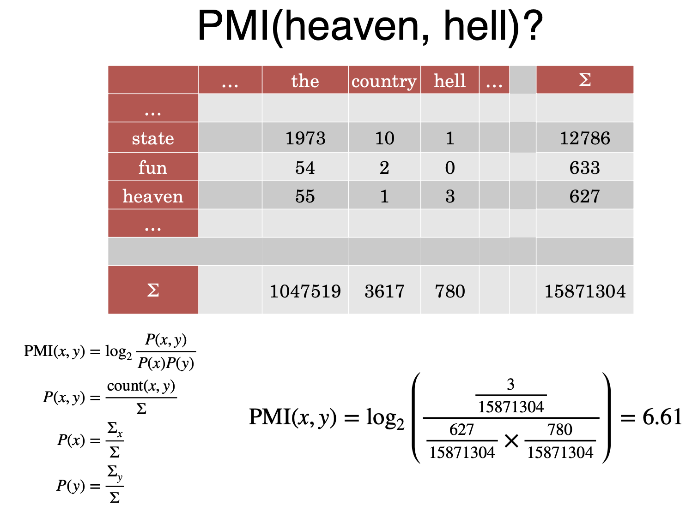
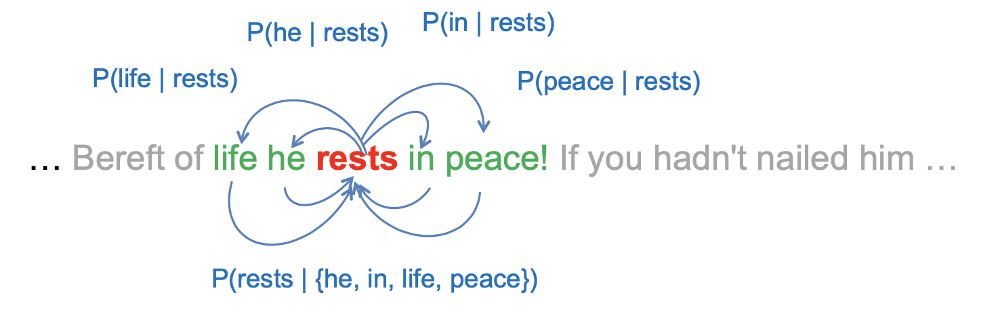
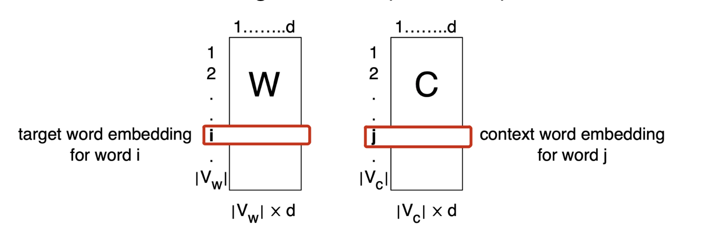
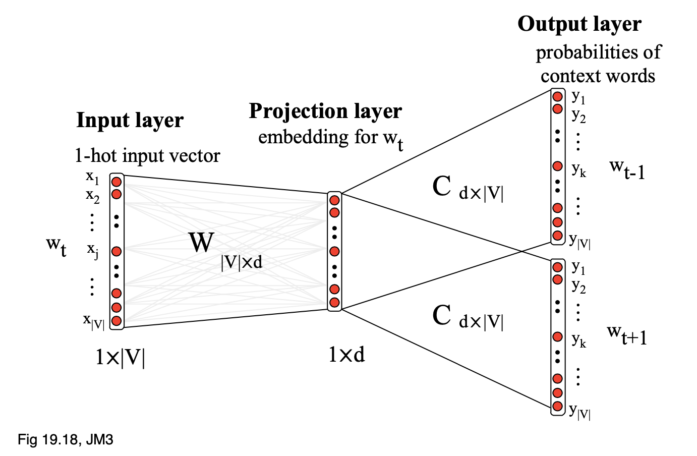
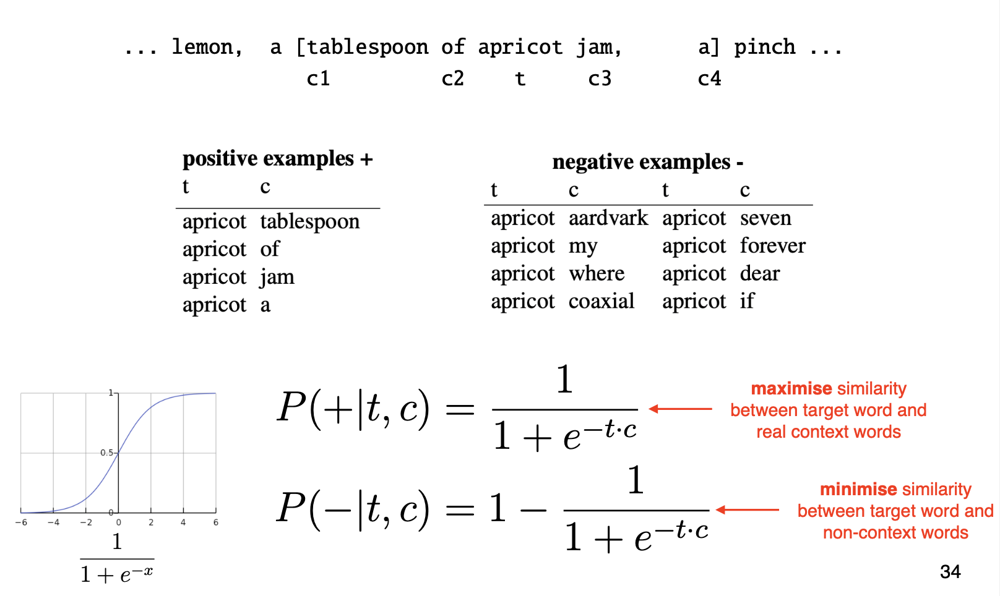

# Lecture 10 Distributional Semantics

### Problems of Lexical Database

* Manual constructed
    * Expensive
    * Human annotation can be biased and noisy
    
* Language is dynamic
    * New words
    * New senses
    
* The Internet provides us with massive amount of text. Using these text to obtain word meanings.

### Word vectors

* Each row can be thought of a word vector
* It describes the distributional properties of a word
    * Encodes information about its context words
    
* Capture all sorts of semantic relationships

<h2 id="count-based">Count-based Generation of Word Vectors</h2>

### Count-based Word Vectors
* Generally two flavors:
    * Use document as context
    * Use neighboring words as context
    
### Document as Context: The Vector Space Model

* Core idea: Represent word meaning as a vector

* Consider documents as context

* One matrix two viewpoints:
    * Documents represented by their words
    * Words represented by their documents
    
* E.g.:
    > 
  
* Manipulating VSM:
    * Weighting the values
    * Creating low-dimensional dense vectors
    
#### TF-IDF 

* Term Frequency - Inverse Document Frequency

* Standard weighting scheme for information retrieval

* Discounts for common words:
    >  
    > where `D` is the count for total documents and dfw is the counts for documents that has word `w`
  
* E.g. 
    > 
    > 
  
  
#### Dimensionality Reduction

* Term-document matrices are very sparse

* Dimensionality reduction: create shorter, denser vectors

* More practical because there are fewer features

* Remove noise therefore avoid overfitting

*  Singular Value Decomposition

    > 

* Truncating: Latent Semantic Analysis
    * Truncating `U` `&#931;` and `V` to k dimensions produces the best possible k rank approximation of original matrix
    * Uk is a new low dimensional representation of words
    * Typical values for k are 100-5000
    > 
  
### Words as Context

* List how often words appear with other words in some predefined context

* The obvious problem with raw frequency: Dominated by common words. But we cannot use TF-IDF

#### Pointwise Mutual Information(PMI)

* For two events `x` and `y`, PMI computes the discrepancy between:
    * Their joint distribution:  
    * Their individual distributions assuming independence:  
    
* Formulation:  

* E.g.
    > 
  
* PMI Matrix: 
    * PMI does a better job of capturing semantics
    * But very biased towards rare word pairs
    * Does not handle zeros well
    
* PMI Tricks:
    * Positive PMI: Zero all negative values. Avoid `-inf` and unreliable negative values
    * Normalized PMI: Counter bias towards rare events.  
    
* SVD:
    * Regardless of whether we use document or word as context, SVD can be applied to create dense vectors
    
<h2 id="neural_word_vec">Neural Methods for Word Vectors</h2>

### Word Embeddings

* Word embeddings are just by-product of neural network models

### Word2Vec

* Core idea: Predict a word using context words

* Framed as learning a classifier:
    * Skip-gram: Predict surrounding words of target word
    > 
    
    * CBOW: Predict target word using surrounding words
    
    * L: Use surrounding words within L positions
    
### Skip-gram Model

* Predicts each neighboring word given target word
    > 
  
* Total probability is defined as:  

* Using a logistic regression model:
    > 
  
* Embedding parameterization:
    * Two word embedding matrices (W and C)
        >  
        
    * Words are numbered
    
* Skip-gram Architecture:
    > 
    
* Training:
    * Train to maximize likelihood of raw text
    * Too slow in practice, due to the normalization over |V|
    * Therefore, reduce problem to binary classification:
        * `(life, rests)` -> real context word
        * `(aardvark, rest)` -> non-context word
        * Randomly draw negative samples from V
        * E.g.
            > 
          
    * Loss:  
        * In practice, use k negative examples:  
    
* Desiderata:
    * Unsupervised: Unlabelled corpus
    * Efficient:
        * Negative sampling: Avoid softmax over full vocabulary
        * Scales to large corpus
    
* Problems:
    * Difficult to quantify the quality of word vectors
    * Don't capture polysemous word(多义词)
    
<h2 id="word_vec_eva">Evaluation for Word Vectors</h2>

### Word Similarity 

* Measure similarity of two words using cosine similarity

* Compare predicted similarity with human intuition

* Datasets:
    * WordSim-353 are pairs of nouns with judged relatedness
    * SimLex-999 also covers verbs and adjectives
    
### Word Analogy

* E.g.
    * `Man` is to `King` as `Woman` to `???`
    * `v(Man) - v(King)` = `v(Woman) - v(???)`
    * Find word whose embedding is closest to `v(Woman) - v(Man) + v(King)`
    
* Embedding Space
    * Word2Vec embeddings show interesting geometry
    * Explains why they are good in word analogy task
    
### Downstream Tasks

* Best evaluation is in other downstream tasks
    * Use Bag-of-Word embeddings as a feature representation in a classifier
    * First layer of most deep learning models is to embed input text
    * Initialize them with pretrained word vectors
    
### General Findings

* neural > count

* Contextual word representation is shown to work better

* Dynamic word vectors that change depending on context