# Lecture 11 Contextual Representation

### Problems with Word Vectors/Embeddings

* Each word type has one representation

* Always the same representation regardless of the context of the word

* Does not capture multiple senses of words

* Contextual representation: Representation of words based on context

* Pretrained contextual representations works very well for downstream applications

### Bidirectional RNN

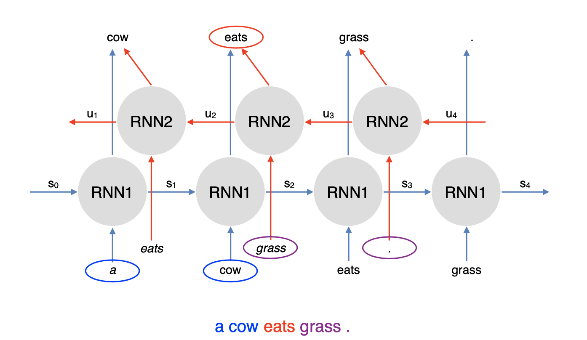

<h2 id="elmo">ELMo</h2>

### Embeddings from Language Models

* Trains a bidirectional, multi-layer LSTM language model over 1 billion word corpus

* Combine hidden states from multiple layers of LSTM for downstream tasks
    * Prior studies use only top layer information
    
* Improves task performance significantly

* Number of LSTM layers = 2

* LSTM hidden dimension = 4096

* Character convolutional networks to create word embeddings. No unknown words
    > 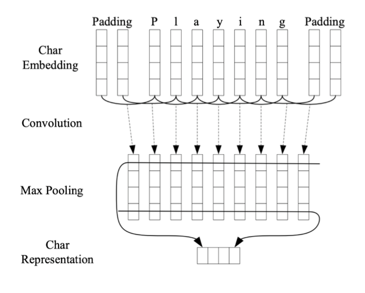
  
* Extracting Contextual Representation:
    > 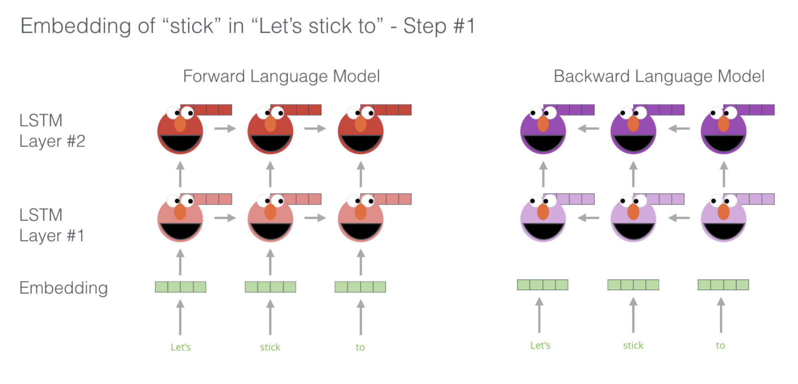 
    > 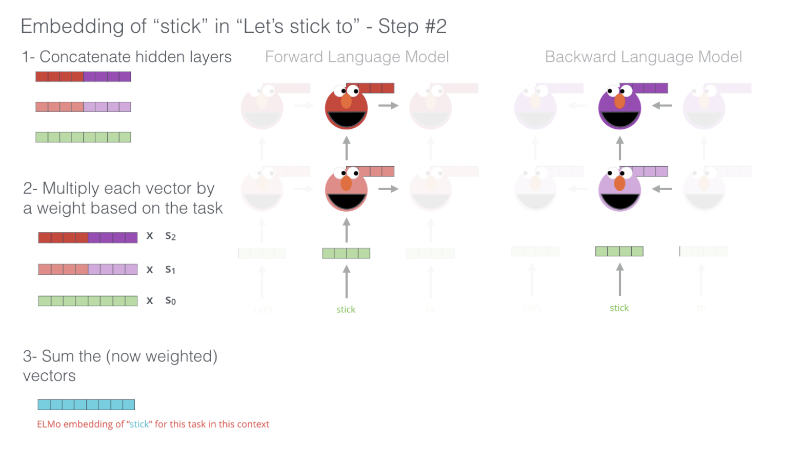
  
### Downstream Task: POS Tagging

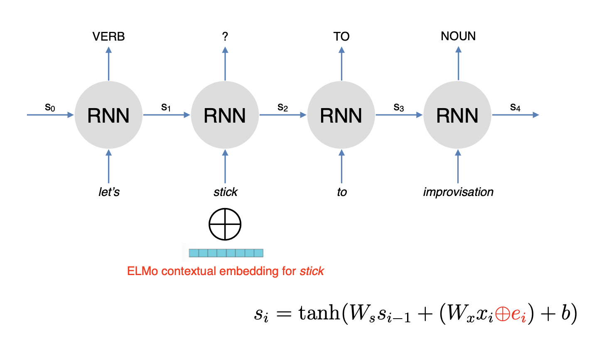

### Other Findings

* Lower layer representation -> captures syntax
    * good for POS tagging, NER
    
* Higher layer representation -> captures semantics
    * good for QA, textual entailment, sentiment analysis
    
### Disadvantages of EMLo

* Difficult to do intrinsic evaluation
* Not very interpretable
* Computationally expensive to train large-scale contextual embeddings
* All languages can be trained, but the performance is very related to the scale of corpus

<h2 id="bert">BERT</h2>

### Disadvantages of RNNs

* Sequential processing: difficult to scale to very large corpus or models

* RNN language models run left to right, which just captures only one side of context

* Bidirectional RNNs help, but they ony capture surface bidirectional representations

* ELMo: Two RNNs are run independently. Information is aggregated after they have separately produced their hidden representations

### BERT: Bidrectional Encoder Representations from Transformers

* Use self-attention networks (Transformers) to capture dependencies between words. No sequential preocessing

* Masked language model objective to capture deep bidirectional representations

* Loses the ability to generate language

* Not an issue if the goal is to learn contextual representations

* Architecture:
    > 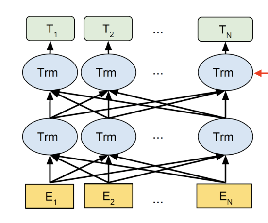
  
* Objective 1: Masked Language Model
    * Mask out k% of tokens at random
    * Objective: predict the masked words
        > 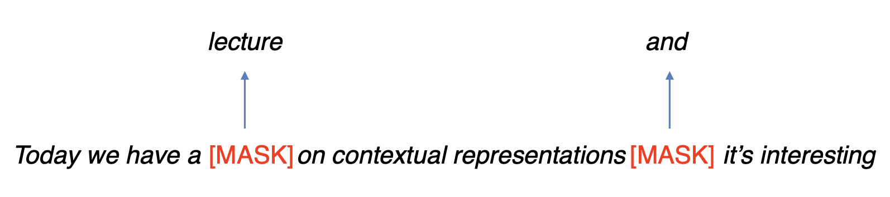
      
* Objective 2: Next Sentence Prediction
    * Learn relationships between sentences
    * Predicts whether sentence `B` follows sentence A
    * Useful pre-training objective for downstream applications that analyze sentence pairs
        > 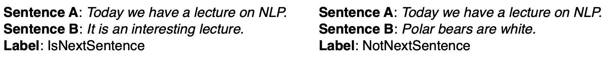
      
* Training/Model Details:
    * WordPiece Tokenization
    * Multiple layers of transformers to learn contextual representations
    * BERT is pretrained on Wikipedia + BookCorpus
    * Training takes multiple GPUs over several days
    
* How to use BERT:
    * Given a pretrained BERT, continue training (fine-tune) it on downstream tasks
    * Add a classification layer on top of the contextual representations
    * E.g. 
      > 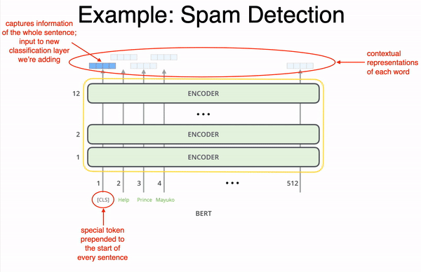
      
* BERT vs ELMo
  * ELMo provides only the contextual representations
  * Downstream applications has their own architecture
  * ELMo parameters are fixed when applied to downstream applications. Only the weights to combine states from different LSTM layers are learned
  * BERT adds a classification layer for downstream tasks. No task-specific model needed
  * BERT updates all parameters during fine-tuning
  
<h2 id="transformers">Transformers</h2>

### Transformers

* Use attention instead of using RNNs to capture dependencies between words
  > 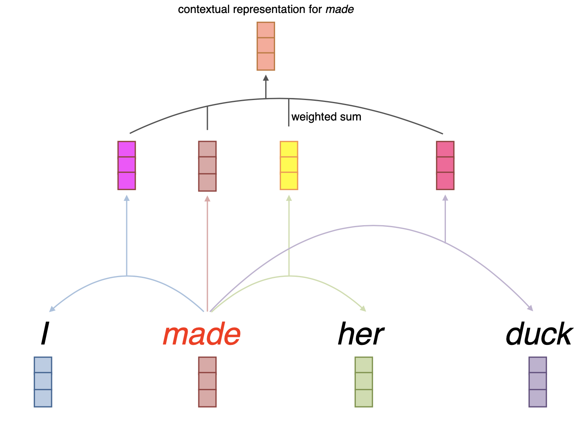
  
* Architecture:
  > 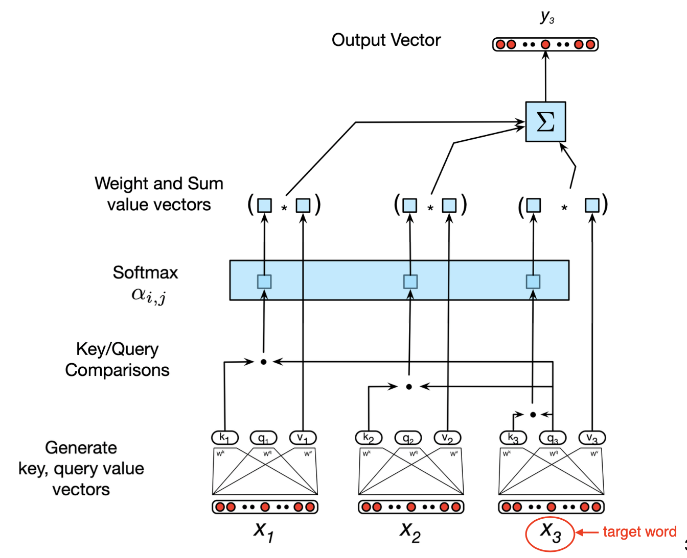
  
### Self-attention via Query, Key, Value

* Input: 
  * query `q` E.g. made
  * key `k` and value `v` E.g. her
  
* Query, key, and value are all vectors, linearly projected from embeddings

* Comparison between query vector of target word `made` and key vectors of context words to compute weights

* Contextual representation of target word  = weighted sum of value vectors of context words and target word:  

* Self-Attention:  
  
  * Multiple queries, stack them in a matrix:  
  
  * Uses scaled dot-product to prevent values from growing too large:  
  
* Only one attention for each word pair

* Use multi-head attention to allow multiple interactions:   
  > 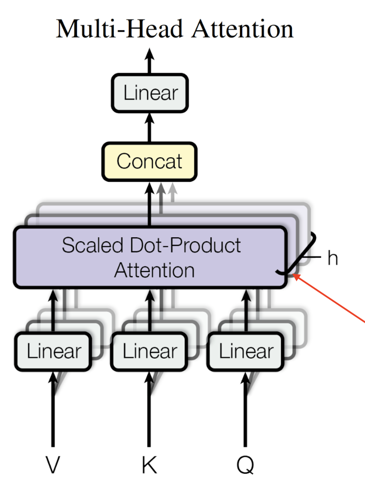
  
### Transformer Block

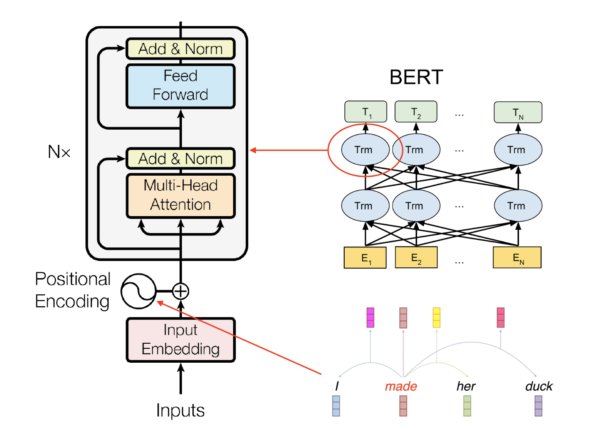