# Lecture 12 Discourse

### Discourse

* Most tasks/models we learned operate at word or sentence level:
    * POS tagging
    * Language models
    * Lexical/distributional semantics
    
* But NLP often deals with documents

* Discourse: Understanding how sentences relate to each other in a document

<h2 id="discourse_seg">Discourse Segmentation</h2>

### Discourse Segmentation

* A document can be viewed as a sequence of segments

* A segment: a span of cohesive text

* Cohesion: organized around a topic or function

### Unsupervised Approaches

* TextTiling algorithm: Looking for points of low lexical cohesion between sentence

* For each sentence gap:
    * Create two BOW vectors consisting of words from `k` sentences on either side of gap
    * Use cosine to get a similarity score `sim` for two vectors
    * For gap `i`, calculate a depth score, insert boundaries when depth is greater than some threshold `t`
    * 
    
* E.g.: 
    > 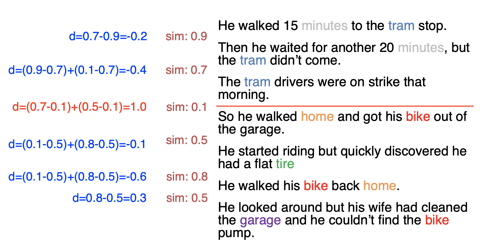 
    > `k = 1, t = 0.9`
  
### Supervised Approaches

* Get labelled data from easy sources:
    * Scientific publications
    * Wikipedia articles
    
* Apply a binary classifier to identify boundaries. Or use sequential classifiers. 

* Potentially include classification of section types

* Integrate a wider range of features:
    * Distributional semantics
    * Discourse markers
    
<h2 id='discourse_par'>Discourse Parsing</h2>

### Discourse Analysis

* Identify discourse units, and the relations that hold between them

* Rhetorical Structure Theory is a framework to do hierarchical analysis of discourse structure in documents

### Discourse Units

* Typically clauses of a sentence 

* Discourse Units do not cross sentence boundary

* E.g. \[It does have beautiful scenery,\] | \[some of the best since Lord of the Rings\]

* 2 merged DUs = another composite DU

### Discourse Relations

* Relations between discourse units:
    * Conjunction, justify, concession, elaboration
    
* E.g.
    > 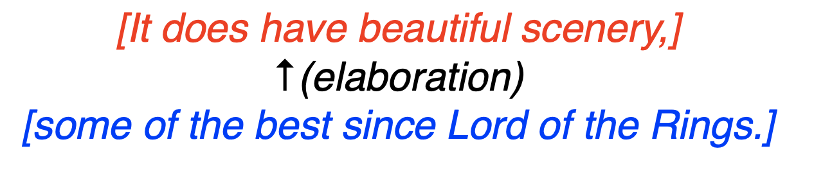
  
### Nucleus vs. Satellite

* Within a discourse relation, one argument is the nucleus (the primary argument).

* The supporting argument is the satellite
    > 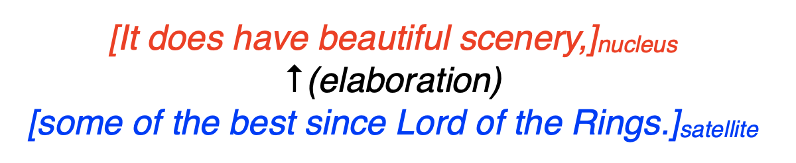
  
* Some relations are equal (conjunction), and so both arguments are nuclei
    > 
  
### RST Tree

* An RST relation combines two or more DUs into composite DUs
* Process of combining DUs is repeated creating an RST Tree
* E.g.
  > 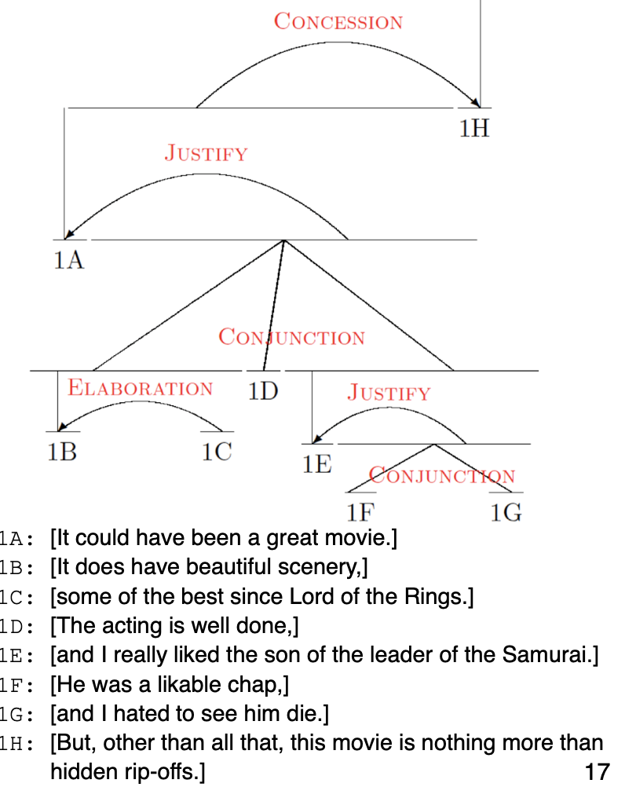
  
### RST Parsing

* Task: given a document, recover the RST tree
* Three approaches:
  * Rule-based parsing
  * Bottom-up approach
  * Top-down approach
  
### Rule-based Parsing: Parsing Using Discourse Markers
* Some discourse markers explicitly indicate relations:
  * although, but, for example, in other words, so, because, in conclusion
  
* Can be used to build a simple rule-based parser

* Problems:
  * Many relations are not marked by discourse marker
  * Many discourse marker ambiguous
  
### Parsing Using Machine Learning

* RST Discourse Treebank: 300+ documents annotated with RST trees

* Basic idea:
  * Segment document into DUs
  * Combine adjacent DUs into composite DUs iteratively to create the full RST 
  
### Bottom-up Parsing

* [Transition-based parsing](#Lecture16): Greedy, uses shift-reduce algorithm

* [CYK/chart parsing algorithm](#Lecture14): Global, but some constraints prevent CYK from finding globally optimal tree for discourse parsing

### Top-down Parsing

1. Segment documents into DUs

2. Decide a boundary to split into 2 segments

3. For each segment, repeat step 2

### Discourse Parsing Features

* Bag of words
* Discourse markers
* Starting and ending n-grams
* Location in the text
* Syntax features
* Lexical and distributional similarities

### Applications of Discourse Parsing

* Summarization
* Sentiment analysis
* Argumentation
* Authorship attribution
* Essay scoring

<h2 id="anaphora_resolution">Anaphora Resolution</h2>

### Anaphors

* Anaphor(照应语): Linguistic expressions that refer back to earlier elements in the text

* Anaphor have a antecedent in the discourse, often but not always a noun phrase
  * E.g. 
    > 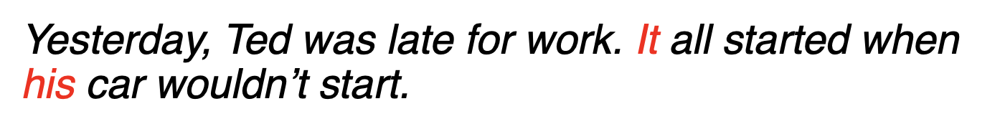
    
* Pronouns are the most common anaphor
* Motivation: Essential for deep semantic analysis
  * Very useful for question answering and reading comprehension
  
### Antecedent Restrictions
* Pronouns must agree in number with their antecedents
  > 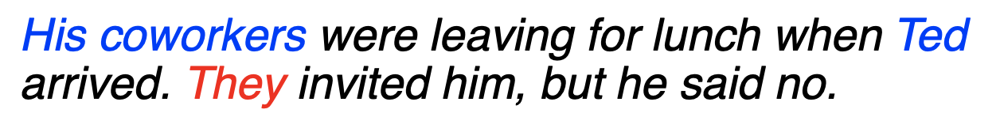
  
* Pronouns must agree in gender with their antecedents
  > 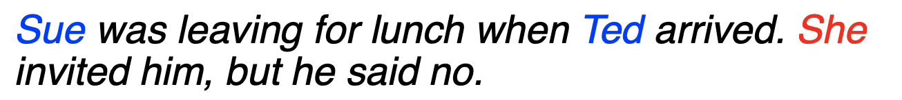
  
* Pronouns whose antecedents are the subject of the same syntactic clause must be reflexive
  > 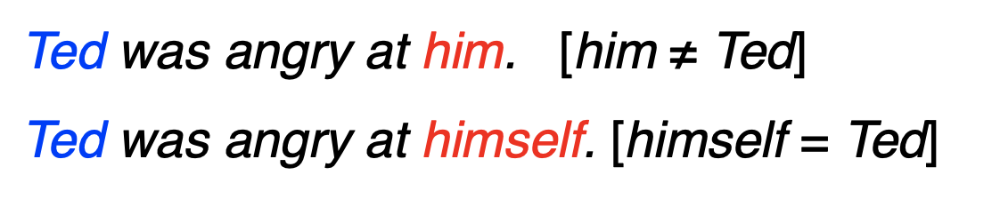
  
### Antecedent Preferences

* The antecedents of pronouns should be recent
  > 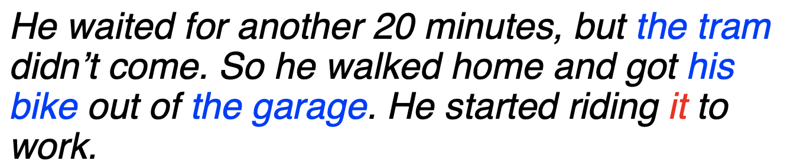
  
* The antecedent should be salient, as determined by grammatical position:
  * Subject > object > argument of preposition
  > 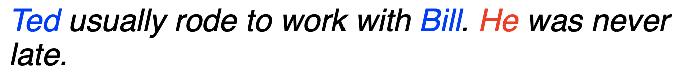
  
### Entities and Reference
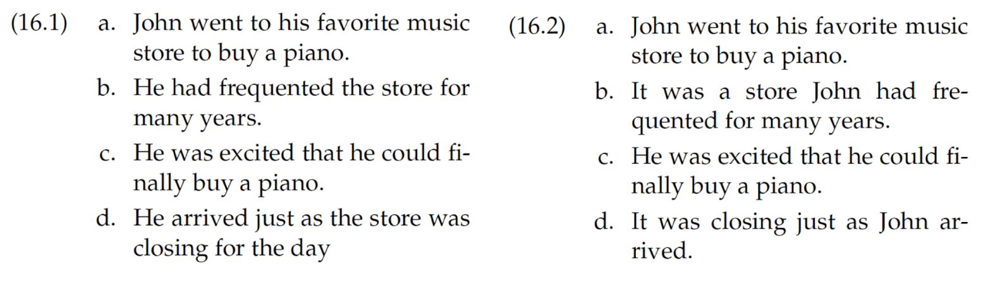

* Discourse 16.1 is more coherent
* Pronouns all refer to John consistently, the protagonist

### Centering Theory

* A unified account of relationship between discourse structure and entity reference
* Every utterance in the discourse is characterized by a set of entities, known as centers
* Explain preference of certain entities for ambiguous pronouns

<h3> For an Utterance Un</h3>

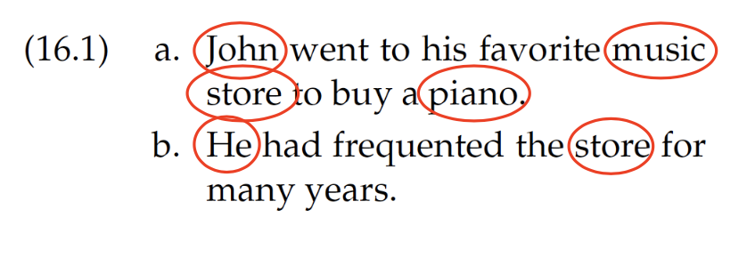

* Forward-looking centers: 
  * All entities in Un: 
  * 
  * Ordered by syntactic prominence: subjects > objects
  
* Backward-looking center:
  * Highest ranked forward-looking center in previous utterance
  * Candidate entities in 16.1 b = `[John, music store]`
  * 
  * Not `music store` because `John` has a higher rank in previous utterance's forward-looking centers
  
### Centering Algorithm

* When resolving entity for anaphora resolution, choose the entity such that top forward-looking center matches with the backward-looking center

* Because the text reads more fluent when this condition is satisfied

### Supervised Anaphor Resolution

* Build a binary classifier for anaphor/antecedent pairs

* Convert restrictions and preferences into features:
  * Binary features for number/gender compatibility
  * Position of antecedent in text
  * Include features about type of antecedent
  
* With enough data, can approximate the centering algorithm

* But also easy to include features that are potentially helpful.
  * Words around anaphor/antecedent