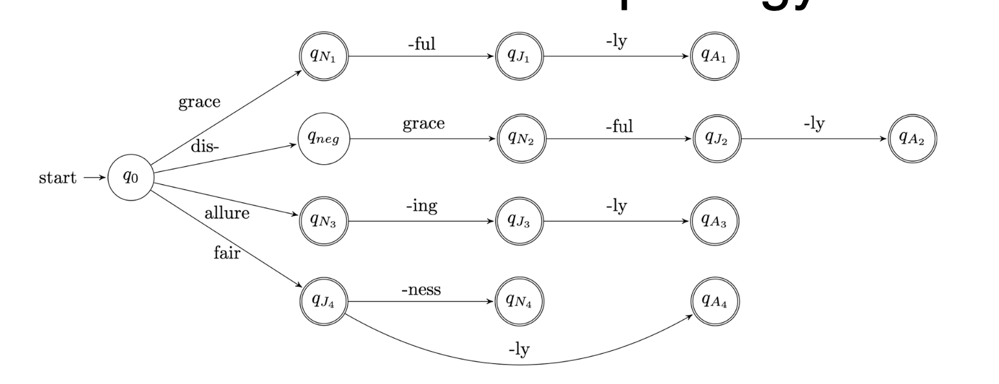
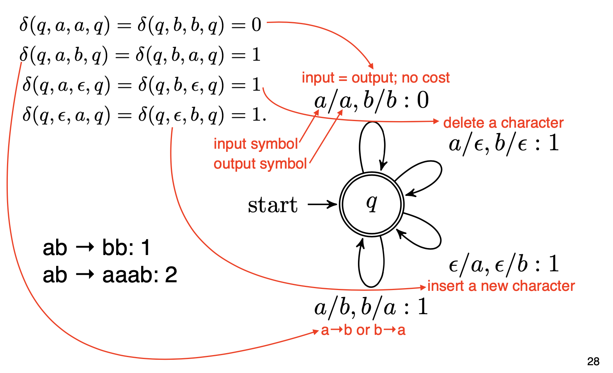
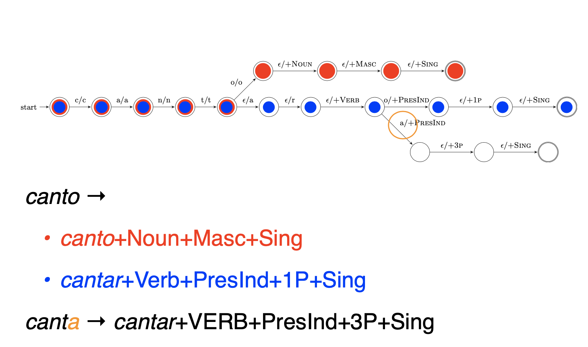

# Lecture 13 Formal Language Theory & Finite State Automata

<h2 id="formal_language_theory">Formal Language Theory</h2>

* Studies classes of languages and their computational properties

* Language: set of strings

* String: sequence of elements from a finite alphabet

* Main goal is to solve the membership problem by defining its grammar. 
    * Membership problem: Whether a string is in a language
    
* E.g. of language:
    * Binary strings that start with 0 and end with 1:
        * `{01, 001, 011, 0001, ....}` belongs to this language
        * `{1, 0, 00, 11, 100, ....}` does not belong to this language
    * Even-length sequences from alphabet `{a, b}`:
        * `{aa, ab, ba, bb, aaaa, ....}` belongs to this language
        * `{aaa, aba, bbb, ....}` does not belong to this language
    
* Beyond membership problem:
    * Scoring:
        * Graded membership: How acceptable is a string
    * Transduction:
        * Translate one string into another

<h2 id="regular_language"> Regular Language</h2>

### Regular Languages

* The simplest class of languages
* Any regular expression is a regular language
    * Describes what strings are part of the language. E.g. `0(0|1)*1`
    
* Formally, a regular expression includes the following operations/definitions:
    * Symbol drawn from alphabet &#931; 
    * Empty string &#949;
    * Concatenation of two regular expression `RS`
    * Alternation of two regular expressions `RIS`
    * Kleene star for 0 or more repeats `R*`
    * Parenthesis `()` to define scope of operations
    
* E.g. 
    * Binary strings that start with 0 and ends with 1: `0(0|1)*1`
    * Even-length sequences from alphabet {a, b}: `((aa)|(ab)|(ba)|(bb))*`
    * English sentences that start with wh-word and end in ?: `((what)|(where)|(why)|(which)|(whose)|(whom))`&#931;`*?`
    
* Properties of Regular Languages:
    * Closure: If we take regular languages L1 and L2 and merge them, is the resulting language regular?
    * Regular languages are closed under these conditions/operations:
        * Concatenation and union
        * Intersection: strings that are valid in both L1 and L2
        * Negation: strings that are not in L
    * Extremely versatile. Can have regular languages for different properties of language, and use the together. 
    
<h2 id="finite_state_acceptor">Finite State Acceptor</h2>

### Finite State Acceptor

* Regular expression defines a regular language. But it does not give an algorithm to check whether a string belongs to a language

* Finite state acceptor (FSA) describes the computation involved for membership checking

* FSA consists:
    * Alphabet of input symbols &#931;
    * Set of states `Q`
    * Start state `q0` &isin; `Q`
    * Final states `F` &sube; `Q`
    * Transition function: symbol and state -> next state
    
* Accepts strings if there is a path from `q0` to a final state with transitions matching each symbol
    * Djisktra's shortest-path algorithm, complexity O(V logV + E)
    
* E.g.:
    * Input alphabet : `{a, b}`
    * States: `{q0, q1}`
    * Start, final states: `q0, {q1}`
    * Transition function: `{(q0, a) -> q0, (q0, b)-> q1, (q1, b) -> q1}`
    * Regular expression defined by this FSA: `a*bb*`
    
### Derivational Morphology

* Use of affixes to change word to another grammatical category
* E.g.:
    * grace -> graceful -> gracefully
    * grace -> disgrace -> disgracefully
    * allure -> alluring -> alluringly
    * allure -> *allureful
    * allure -> *disallure
    
* FSA for Morphology:
    * Want to accept valid forms (grace -> graceful)
    * Reject invalid ones (allure -> *allureful)
    * generalize to other words
    > 
  
### Weighted FSA

* Some words are more plausible than others:
    * fishful vs. disgracelyful
    * musicky vs. writey
    
* Weighted FSA: graded measure of acceptability:
    * Start state weight function: &lambda;: Q -> R
    * Final state weight function: &rho;: Q -> R
    * Transition function: &delta;:(Q, &Sigma;, Q) -> R
    
* Shortest-Path:
    * Total score of a path: 
     > 
    
    * Use shortest-path algorithm to find &pi; with minimum cost. Complexity: O(V logV + E)
    
<h2 id="finite_state_transducer">Finite State Transducer</h2>

### Finite State Transducer (FST)

* Often do not want to just accept or score strings. But want to translate them into another string. 

* FST add string output capability to FSA
    * Includes an output alphabet
    * Transitions now take input symbol and emit output symbol (Q, &Sigma;, &Sigma, Q)
    
* Can be weighted (WFST) : Graded scores for transition

* E.g. Edit distance as WFST: distance to transform one string to another
    > 
  
### FST for Inflectional Morphology

* Verb inflection in Spanish must match the subject in person and number
* Goal of morphological analysis:
    * canto -> cantar + VERB + present + 1P + singular
    > 
  
### Non-Regular Languages

* Arithmetic expressions with balanced parentheses
    * (a + (b * (c / d)))
    * Can have arbitrarily many opening parentheses
    * Need to remember how many open parentheses to produce the same number of closed parentheses
    * Can not be done with finite number of states
    
### Center Embedding
* Center embedding of relative clauses
    * The cat loves Mozart
    * The cat the dog chased loves Mozart
    * The cat the dog the rat bit chased loves Mozart
    * The cat the dog the rat the elephant admired bit chased loves Mozart
    
* Need to remember the n subject nouns, to ensure n verbs follow
* Requires context-free grammar