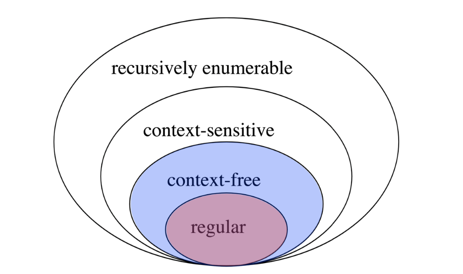

# Lecture 13 Formal Language Theory & Finite State Automata

<h2 id="formal_language_theory">Formal Language Theory</h2>

* Studies classes of languages and their computational properties

* Language: set of strings

* String: sequence of elements from a finite alphabet

* Main goal is to solve the membership problem by defining its grammar. 
    * Membership problem: Whether a string is in a language
    
* E.g. of language:
    * Binary strings that start with 0 and end with 1:
        * `{01, 001, 011, 0001, ....}` belongs to this language
        * `{1, 0, 00, 11, 100, ....}` does not belong to this language
    * Even-length sequences from alphabet `{a, b}`:
        * `{aa, ab, ba, bb, aaaa, ....}` belongs to this language
        * `{aaa, aba, bbb, ....}` does not belong to this language
    
* Beyond membership problem:
    * Scoring:
        * Graded membership: How acceptable is a string
    * Transduction:
        * Translate one string into another

<h2 id="regular_language"> Regular Language</h2>

### Regular Languages

* The simplest class of languages
* Any regular expression is a regular language
    * Describes what strings are part of the language. E.g. `0(0|1)*1`
    
* Formally, a regular expression includes the following operations/definitions:
    * Symbol drawn from alphabet &#931; 
    * Empty string &#949;
    * Concatenation of two regular expression `RS`
    * Alternation of two regular expressions `RIS`
    * Kleene star for 0 or more repeats `R*`
    * Parenthesis `()` to define scope of operations
    
* E.g. 
    * Binary strings that start with 0 and ends with 1: `0(0|1)*1`
    * Even-length sequences from alphabet {a, b}: `((aa)|(ab)|(ba)|(bb))*`
    * English sentences that start with wh-word and end in ?: ((what)|(where)|(why)|(which)|(whose)|(whom))&#931;*?
    
* Properties of Regular Languages:
    * Closure: If we take regular languages L1 and L2 and merge them, is the resulting language regular?
    * Regular languages are closed under these conditions/operations:
        * Concatenation and union
        * Intersection: strings that are valid in both L1 and L2
        * Negation: strings that are not in L
    * Extremely versatile. Can have regular languages for different properties of language, and use the together. 
    
<h2 id="finite_state_acceptor">Finite State Acceptor</h2>

### Finite State Acceptor

* Regular expression defines a regular language. But it does not give an algorithm to check whether a string belongs to a language

* Finite state acceptor (FSA) describes the computation involved for membership checking

* FSA consists:
    * Alphabet of input symbols &#931;
    * Set of states `Q`
    * Start state q0 &isin; Q
    * 