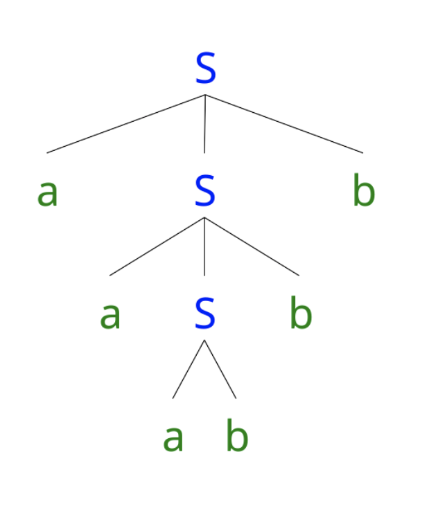
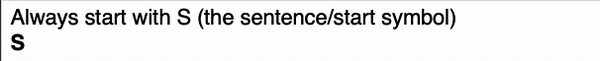
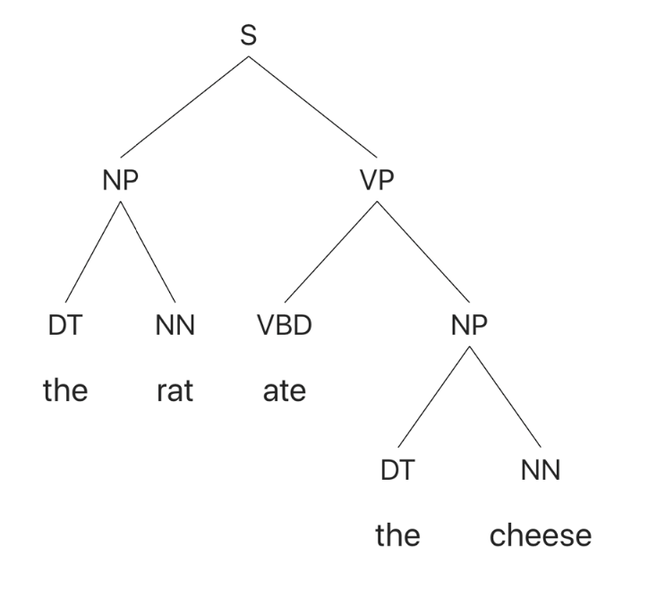
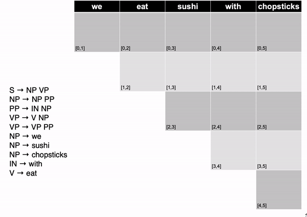
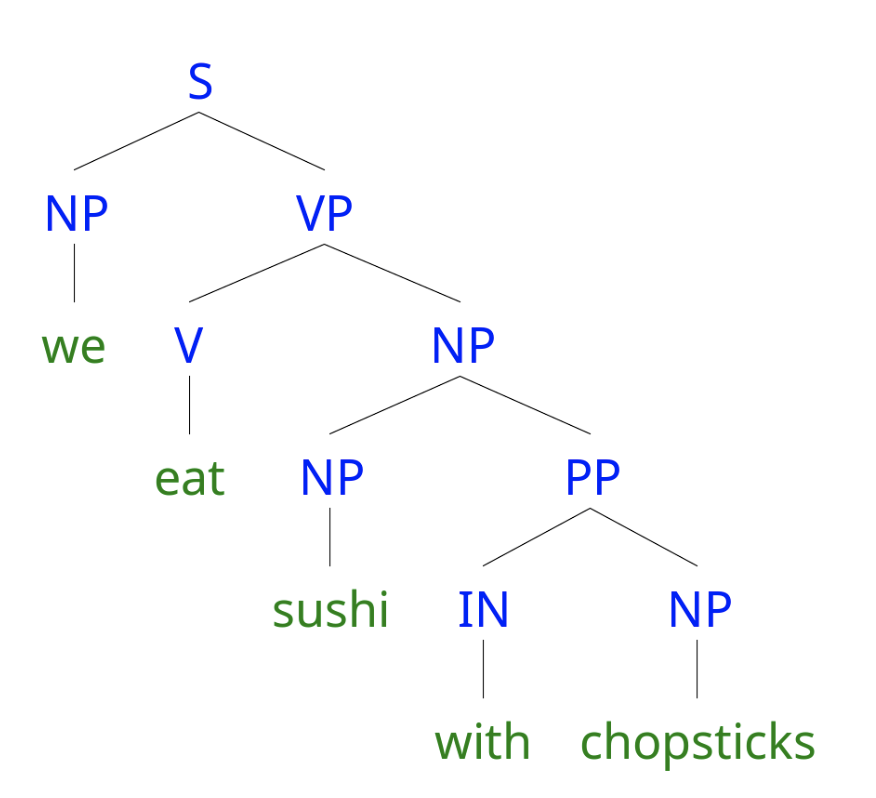
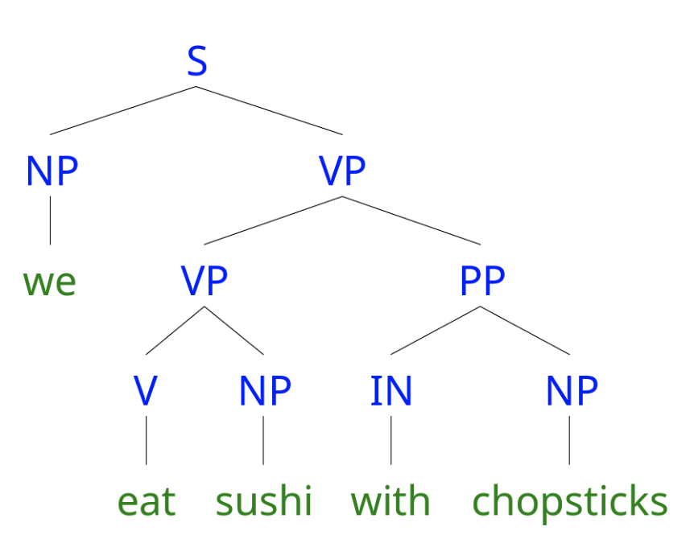

# Lecture 14 Context-Free Grammar

## Context-Free Grammar

### Basics of Context-Free Grammars

* Symbols:
    * Terminal: word such as `book`
    * Non-terminal: syntactic label such as `NP` and `VP`
    * convention:
        * lowercase for terminals
        * uppercase for non-terminals
    
* Productions:
    * `W  -> X Y Z`
    * Exactly one non-terminal on the LHS
    * An ordered list of symbols on the RHS, can be terminals or non-terminals
    
* Start symbol: `S`

* Context-Free:
    * Production rules depends only on the LHS, not on ancestors, neighbors
        * Analogous to Markov chain
        * Behaviour at each steps depends only on the current state
    * Context-Free languages more general than regular languages. Allows recursive nesting
    
### CFG Parsing

* Given production rules: E.g.
    * `S -> a S b`
    * `S -> a b`
    
* And a string: `aaabbb`
* Produce a valid parse tree:
    > 
    
* If English can be represented with CFG:
    * First develop the production rules
    * Can then build a parser to automatically judge whether a sentence is grammatical
    
* CFG strike a good balance:
    * CFG covers most syntactic patterns
    * CFG parsing in computational efficient
    
## Constituents

### Syntactic Constituents

* Sentences are broken into constituents
    * Word sequence that function as a coherent unit for linguistic analysis
    * Helps build CFG production rules
    
* Constituents have certain key properties:
    * movement: Constituents can be moved around sentences:
        * `Abigail gave [her brother] [a fish]`
        * `Abigail gave [a fish] to [her brother]`
        * Contrast: `[gave her]` and `[brother a]`
    * substitution: Constituents can be substituted by other phrases of the same type:
        * `Max thanked [his older sister]`
        * `Max thanked [her]`
        * Contrast: `[Max thanked]` and `[thanked his]`
    * coordination: Constituents can be conjoined with other coordinators like `and` and `or`"
        * `[Abigail] and [her young brother] brought a fish`
        * `Abigail [bought a fish] and [gave it to Max]`
        * `Abigail [bought] and [greedily ate] a fish`
    
### Constituents and Phrases

* Once identify constituents, use phrases to describe them

* Phrases are determined by their head word:
    * Noun phrase: `her younger brother`
    * Verb phrase: `greedily ate it`
    
### Example: A Simple CFG for English and generating sentences

* Terminal Symbols: `rat`, `the`, `ate`, `cheese`
* Non-terminal symbols: `S`, `NP`, `VP`, `DT`, `VBD`, `NN`
* Productions:
    * `S -> NP VP`
    * `NP -> DT NN`
    * `VP -> VBD NP`
    * `DT -> the`
    * `NN -> rat`
    * `NN -> cheese`
    * `VBD -> ate`
    
* Generating Sentences with CFGs:
    > 
  
### CFG Trees

* Generation corresponds to a syntactic tree

* Non-terminals are internal nodes

* Terminals are leaves

* CFG parsing is the reverse process

* E.g.:
    > 
  
## CYK Algorithm

### CYK Algorithm

* Bottom-up parsing

* Tests whether a string is valid given a CFG, without enumerating all possible parses

* Core idea: Form small constituents first, and merge them into larger constituents

* Requirement: CFGs must be in Chomsky Normal Forms

### Convert to Chomsky Normal Form

* Change grammar so all rules of form:
    * `A -> B C`: Non-terminal LHS to two non-terminals RHS
    * `A -> a`: Non-terminal LHS to one terminal RHS
    
* To meet requirements
    * convert rules of form `A -> B c` into:
        * `A -> B X` and `X -> c`
    
    * convert rules of form `A -> B C D` into:
        * `A -> B Y` and `Y -> C D`
    
* CNF disallows unary rules like `A -> B` to avoid infinite loops
    * Replace RHS non-terminal with its productions:
        * `A -> B, B -> cat, B -> dog` -> `A -> cat, A -> dog`
    
### The CYK Parsing Algorithm

* Convert grammar to Chomsky Normal Form 
* Fill in a parse table, left to right, bottom to top
* Use table to derive parse
* `S` in top right corner of table -> success
* Convert result back to original grammar
* E.g.
    > 
  
* Retrieving the Parses

    * S in the top-right corner of parse table indicates success
    
    * To get parses, follow pointer back for each match:
        > <br>
      * If multiple solutions are available, all of the trees are valid:
        > 
        
* Pseudo Code:
```
function CYK-Parse(words, grammar) returns table
    for j <- from 1 to LENGTH(words) do
        for all {A | A -> words[j] ∈ grammar}
            table[j-1, j] <- table[j-1, j] ∪ A
        for i <- from j-2 down to 0 do
            for k <- i + 1 to j - 1 do
                for all {A | A -> BC ∈ grammar and B ∈ table[i, k] and C ∈ table[k, j]
                    table[i, j] <- table[i, j] ∪ A
                    
    return table
```