# Lecture 15 Probabilistic Context-Free Grammar

### Ambiguity in Parsing

* Context-Free grammars assign hierarchical structure to language
    * Formulated as generating all strings in the language
    * Predicting the structure for a given string
    
* Raises problem of ambiguity: Two parse tree from the same tree, which is better

## Basics of PCFGs

### Basics of PCFGs

* Same symbol set:
    * Terminals: words such as `book`
    * Non-terminals: syntactic labels such as `NP` or `NN`
    
* Same production rules:
    * LHS non-terminal -> ordered list of RHS symbols
    
* In addition, store a probability with each production:
    * `NP -> DT NN      [p = 0.45]`
    * `NN -> cat        [p = 0.02]`
    * `NN -> leprechaun [p = 0.00001]`
    
* Probability values denote conditional: 
    * `P(LHS -> RHS)`
    * `P(RHS | LHS)`
    
* Consequently they:
    * Must be positive values, between 0 and 1
    * Must sum to one for given LHS
    
* E.g. 
    * `NN -> aadvark    [p = 0.0003]`
    * `NN -> cat        [p = 0.02]`
    * `NN -> leprechaun [p = 0.01]`
    * `∑x P(NN -> x) = 1`
    
### Stochastic Generation with PCFGs

* Almost the same as for CFG, with one twist:
    1. Start with `S`, the sentence symbol
    2. Choose a rule with `S` as the LHS
        * Randomly select a RHS according to `P(RHS | LSH)`
        * Apply this rule
    3. Repeat step 2 for each non-terminal in the string
    4. Stop when no non-terminal terminal
    
* Output a tree with sentence as the yield
    * Given a tree, compute its probability
        > 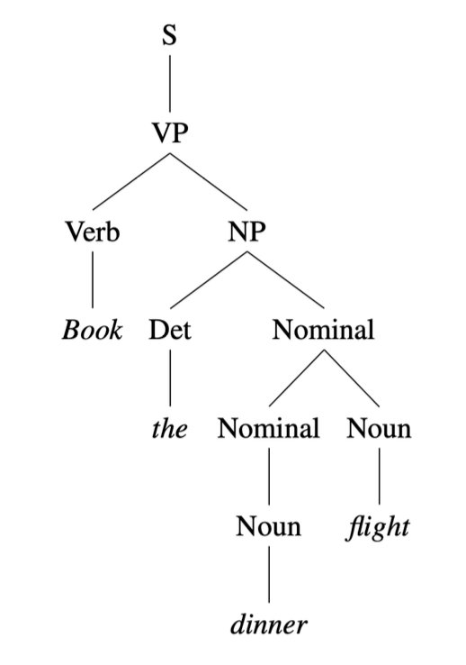<br>
        > 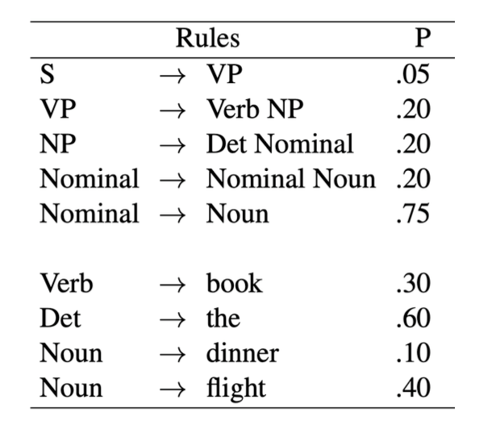
    * For this tree: P(tree) = <br>`P(S → VP) × P(VP → Verb NP) × P(Verb → Book) × P(NP → Det Nominal) × P(Det → the) × P(Nominal → Nominal Noun) × P(Nominal → Noun) × P(Noun → dinner) × P(Noun → flight)` 
      = `0.05 × 0.20 × 0.30 × 0.20 × 0.60 × 0.20 × 0.75 × 0.10 × 0.40 `
      = `2.2 × 10-6`
      
* This resolve the problem of parsing ambiguity:
    * Can select between different tree based on P(tree)
        > 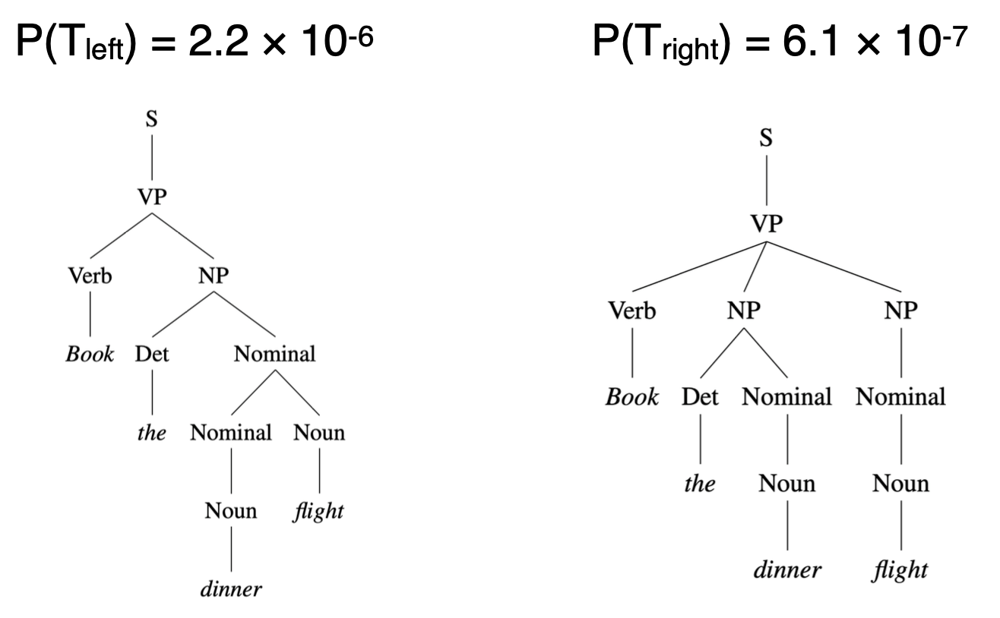
      
## PCFG Parsing

### CYK for PCFGs

* CYK finds all trees for a sentence: want the best tree

* Probabilistic CYK allows similar process to standard CYK

* Convert grammar to Chomsky Normal Form
    * From: `VP -> Verb NP NP [p = 0.10]`
    * To: `VP -> Verb NP+NP[p = 0.10]; NP+NP -> NP NP[p = 1.0]`
  
* E.g.
  > 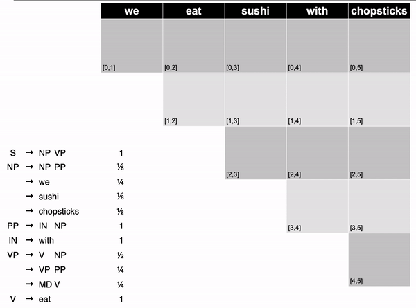
  
* Retrieving the Parses
  * `S` in the top-right corner of parse table indicates success
  * Retain back-pointer to best analysis
  * To get parse, follow pointers back for each match
  * Convert back from CNF by removing new non-terminals
  * E.g. 
    > 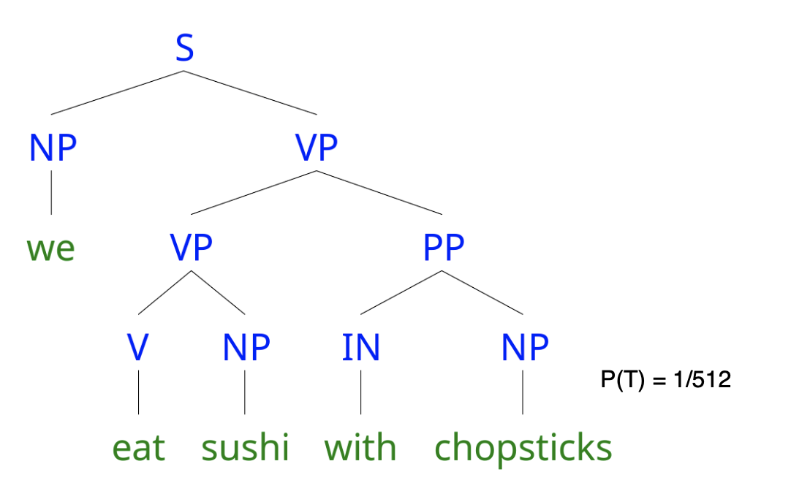
    
* Pseudocode Code for Probabilistic CYK:
```
function Probabilistic-CYK(words, grammar) return most probable parse and its probability
  for j <- from 1 to LENGTH(words) do
    for all {A | A -> words[j] ∈ grammar}
      table[j-1, j, A] <- P(A -> words[j])
    for i <- from j-2 downto 0 do
      for k <- i+1 to j-1 do
        for all {A|A -> BC ∈ grammar, and table[i, k, B] > 0 and table[k, j, C] > 0}
          if (table[i, j, A] < P(A -> BC) × table[i, k, B] × table[k, j, C]) then
            table[i, j, A] <- P(A -> BC) × table[i, k, B] × table[k, j, C]
            back[i, j, A] <- {k, B, C}
  return BUILD_TREE(back[1, LENGTH(words), S]), table[1, LENGTH(words), S]
```

## Limitations of CFG

### Poor Independence Assumptions

* Rewrite decisions made independently, whereas interdependence is often needed to capture global structure
* E.g.:
    * `NP -> DT NN [p = 0.28]` and `NP -> PRP [p = 0.25]`
    * Probability of a rule is independent of rest of tree
    * No way to represent this contextual difference in PCFG probabilities: 
      > 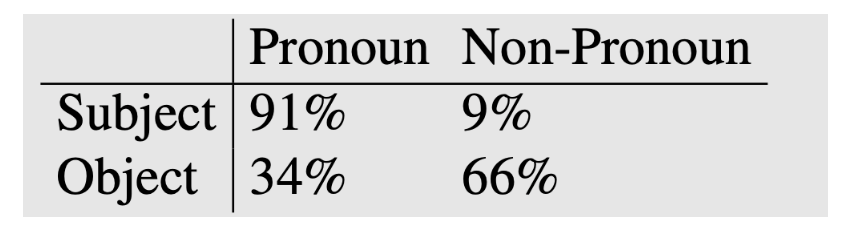
      
    * `NP -> PRP` should go up to 0.91 as a subject
    * `NP -> DT NN` should be 0.66 as an object
  
* Solution: add a condition to denote whether NP is a subject or object (Parent Conditioning)
  * Make non-terminals more explicit by incorporating parent symbol into each symbol
  * E.g. 
    > 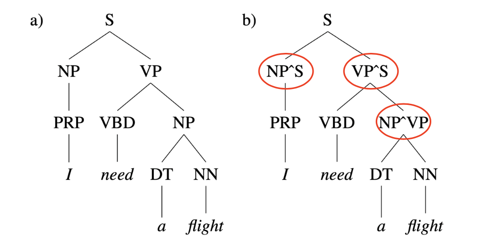
    
    * `NP^S` represents subject position 
    * `NP^VP` represents object position
  
### Lack of Lexical Conditioning

* Lack of sensitivity to words in tree
* Prepositional phrase `PP` attachment ambiguity
* E.g. `Worker dumped sacks into bin`
    > 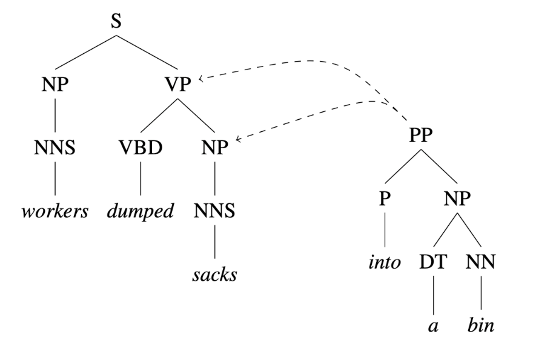
  * `into a bin` describes the resulting location of the sack. So correct tree should be:
    > 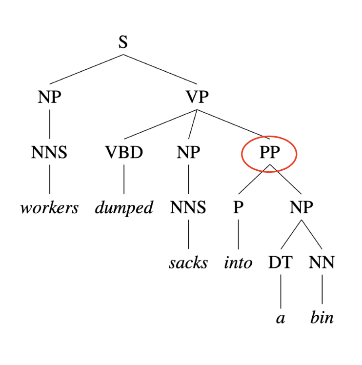
    
* Coordination Ambiguity:  
  * `dogs in houses and cats`
  * `dogs` is semantically a better conjunct for `cats` than `house`
    > 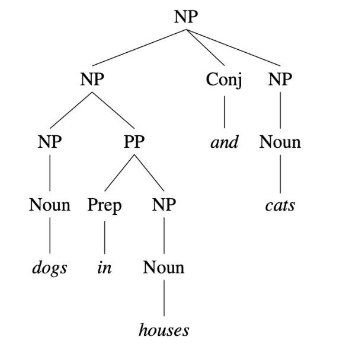
    
* Solution: Head Lexicalization
  * Record head word with parent symbols
    * Head word: the most salient child of a constituent, usually the noun in `NP`, verb in `VP`
    > 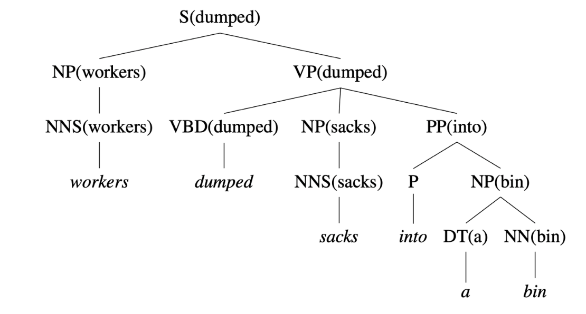
    
    * `VP -> VBD NP PP` to `VP(dumped) → VBD(dumped) NP(sacks) PP(into)`
  
  * Incorporate head words into productions, to capture the most important links between words
    * Captures correlations between head words of phrases
  * Grammar symbol inventory expands massively. Many production rule are too specific, rarely seen. 
    * Leaning more involved to avoid sparsity problems
    