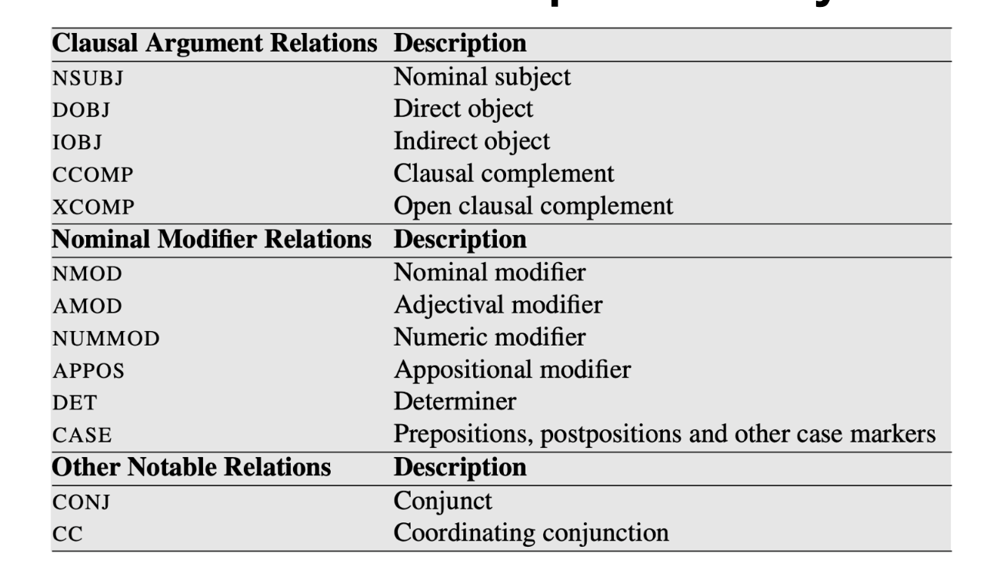
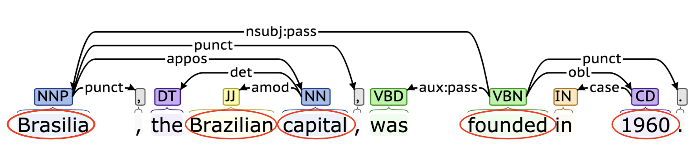
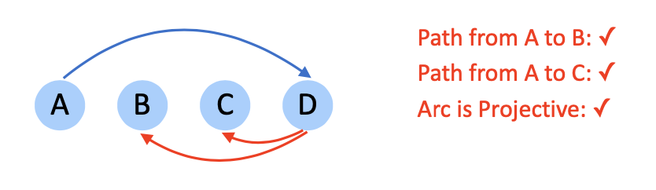
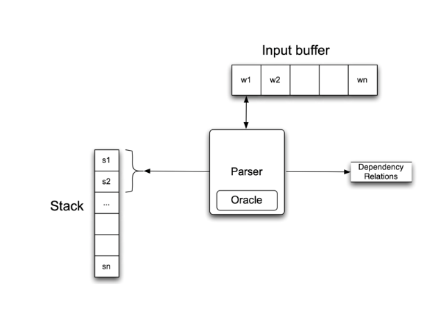
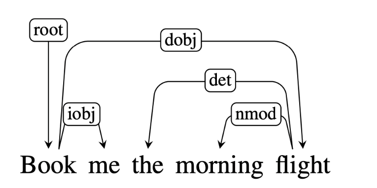
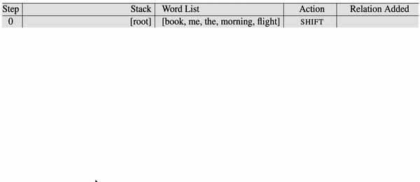

# Lecture 16 Dependency Grammar

## Dependency Grammar

### Dependency Grammar

* Dependency grammar offers a simpler approach to CFG:
    * Describe relations between pairs of words
    * Namely, between heads and dependents
    
* Deal better with languages that are morphologically rich and have a relatively free word order
    * CFG need a separate rule for each possible place a phrase can occur in
    
* Head-dependent relations similar to semantic relations between words
    * More useful for applications: coreference resolution, information extraction
    
### Dependency Relations

* Captures the grammatical relation between:
    * Head: central word
    * Dependent: supporting word
    
* Grammatical relation: subject, direct object, ...

* Many dependency theories and taxonomies proposed for different languages

* Universal dependency: a framework to create a set of dependency relations that are computationally useful and cross-lingual
    > 
  
### Application: Question Answering

* Dependency tree more directly represents the core of the sentence: who did want to whom?
    * Captured by the links incident on verb nodes
    > 
  
### Application: Information Extraction

* `Brasilia, the Brazilian capital, was founded in 1960.` to `capital(Brazil, Brasilia); founded(Brasilia, 1960)`
* Dependency tree captures relations succinctly
    > 
  
### Dependency vs. Constituency

* Dependency tree:
    * Each node is a word token
    * One node is chosen as the root
    * Directed edges link heads and their dependents
    
* Constituency tree:
    * Forms a hierarchical tree
    * Word tokens are the leaves
    * Internal nodes are constituent phrases
    
* Both use POS

### Properties of a Dependency Tree

* Each word has a single head (parent)
* There is a single root node
* There is a unique path to each word from the root
* All arcs should be projective

### Projectivity

* An arc is projetive if there is a path from head to every word that lies between head and the dependent
    > 
  
* Dependency tree is projective if all arcs are projective. In other words, a dependency tree is projective if it can be drawn with no crossing edges

* Most sentences are projective, but exception exist

### Treebank Conversion

* A few dependency treebanks but many constituency treebanks
* Some constituency treebanks can be converted into dependencies
* Dependency trees generated from constituency trees are always projective
* Main idea: Identify head-dependent relations in constituency structure and the corresponding dependency relations
    * Use various heuristics
    * Often with manual correction
    
## Transition-based Parsing

### Dependency Parsing

* Find the best structure for a given input sentence
* Two main approaches:
    * Transition-based: Bottom-up greedy method
    * Graph-based: encodes problem using nodes/edges and use graph theory methods to find optimal solutions
    
* Caveat:
    * Transition-based parsers can only handle projective dependency trees
    * Less applicable for languages where cross-dependencies are common
    
### Transition-Based Parsing

* Processes word from left to right
* Maintain two data structures:
    * Buffer: Input words yet to be processed
    * Stack: Store words that are being processed
    > 
    
* At each step, perform one of the 3 actions:
    * Shift: Move a word from buffer to stack
    * Left-Arc: Assign current words as the head of the previous word in stack
    * Right-Arc: Assign previous word as head of current word in stack
    
* E.g.
  >  
  > 
  
* For simplicity, omit labels on the dependency relations. In practice, we parameterize the left-arc and right-arc with dependency labels:
  * E.g. `left-arc-nsubj` or `right-arc-dobj`
  
* Expands the list of actions to > 3 types

* Assume an oracle that tells the correct action at every step. Given a dependency tree, the role of oracle is to generate a sequence of ground truth action.

### Parsing Model

* Train a supervised model to mimic the actions of the oracle
  * To learn at every step the correct action to take
  * At test time, the trained model can be used to parse a sentence to create the dependency tree
  
* Parse as Classification:
  * Input: 
    * Stack: top two elements: s1 and s2
    * Buffer: first element: b1
  * Output:
    * 3 classes: `shift`, `left-arc`, `right-arc`
  * Features:
    * word, part-of-speech
  
* Traditionally SVM works best. Nowadays, deep learning models are SOTA
* Weakness: local classifier based on greedy search
* Solution:
  * Beam Search: Keep track of top-N best actions
  * Dynamic oracle: during training, use predicted actions occasionally
  * Graph-based parser
  
## Graph-based Parsing

### Graph-based Parsing

* Given an input sentence, construct a fully-connected, weighted, directed graph

* Vertices: all words

* Edges: head-dependent arcs

* Weight: score based on training data (relation that is frequently observed receive in a higher score)

* Objective: find the maximum spanning tree (Kruskal's algorithm)

* Advantage
  * Can produce non-projective trees
  
  * Score the entire trees:
    * Avoid making greedy local decisions like transition-based parsers
    * Captures long dependencies better
  
* E.g.:
  > 
  
* Caveat: Tree may contain cycles
  * Solution: Need to do cleanup to remove cycles
