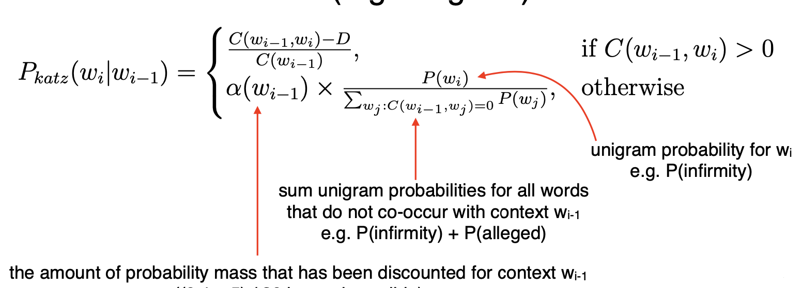
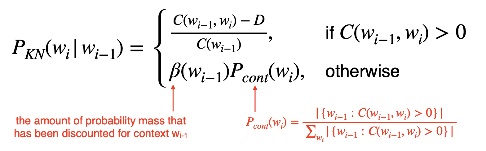
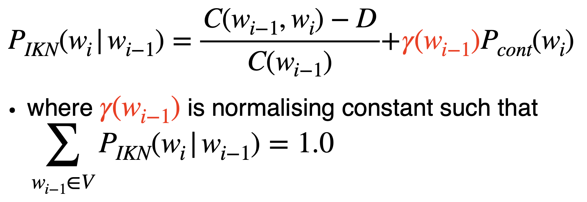
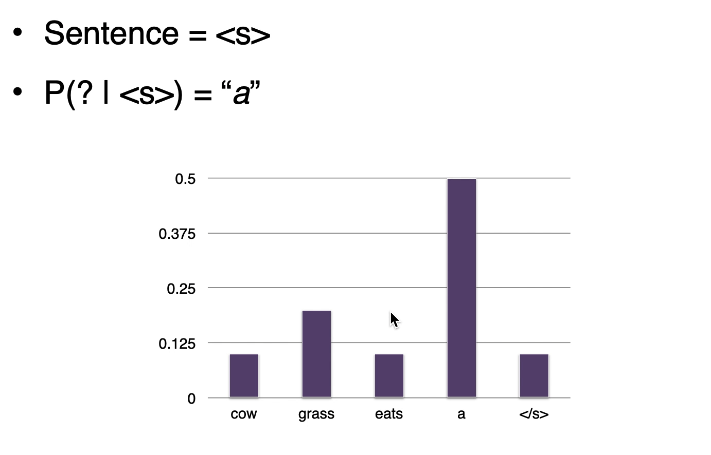

# Lecture 3 N-gram Language Models

<h2 id="language_model">Language Models</h2>

* One application NLP is about <i>explaining language</i>: Why some sentences are more fluent than others
* E.g. in speech recognition: recognize speech > wreck a nice beach
* Measures "goodness" using probabilities estimated by language models
* Language model can also be used for generation
* Language model is useful for:
    * Query completion
    * Optical character recognition
    * And other generation tasks:
        * Machine translation
        * Summarization
        * Dialogue systems
* Nowadays pretrained language models are the backbone of modern NLP systems

<h2 id="ngram">N-gram Language Model</h2>

### Probabilities: Joint to Conditional

* Goal of language model is to get a probability for an arbitrary sequence of <i>m</i> words:   
  

* First step is to apply the chain rule to convert joint probabilities to conditional ones:
  
  
### The Markov Assumption

*  is still intractable, so make a simplifying assumption:
    
* For some small <i>n</i>: 
  
    * When n = 1, it is a unigram model: 
      > 
      
    * When n = 2, it is a bigram model: 
      > 
      
    * When n = 3, it is a trigram model: 
      > 

### Maximum Likelihood Estimation

* Estimate the probabilities based on counts in the corpus:
    * For unigram models:
      
      
    * For bigram models:
      

    * For n-gram models generally:
      

### Book-ending Sequences

* Special tags used to denote start and end of sequence:
    * `<s>` = sentence start
    * `</s>` = sentence end
    
### Problems with N-gram models

* Language has long distance effects, therefore large n required. 
  > The lecture/s that took place last week was/were on preprocessing
  * The "was/were" here is mentioning "lecture/s" which is 6 words ahead. Therefore need a 6-grams
    
* Resulting probabilities are often very small
    * Possible solution: Use log probability to avoid numerical underflow
    
* Unseen words:
    * Special symbol to represent. E.g. `<UNK>`
    
* Unseen n-grams: Because the opertaion is multiplication, if one term in the multiplication is 0 then whole probability is 0
    * Need to smooth the n-gram language model
    
<h2 id="smoothing">Smoothing</h2>

### Smoothing

* Basic idea: give events you have never seen before some probability
* Must be the case that 
* Many different kinds of smoothing
    * [Laplacian(add-one) smoothing](#add-one)
    * [Add-k smoothing](#add-k)
    * [Absolute discounting](#absolute_discount)
    * [Katz Backoff](#katz)
    * [Kneser-Ney](#kneser-ney)
    * [Interpolation](#interpolation)
    * [Interpolated Kneser-Ney Smoothing](#interpolated_kneser-ney)

<h3 id="add-one">Laplacian(add-one) smoothing</h3>

* Simple idea: pretend we have seen each n-gram once more than we did.
* For unigram models:
    
  
* For bigram models:
  

<h3 id="add-k">Add-k smoothing</h3>

* Adding one is often too much. Instead, add a fraction k.
* Also called Lidstone Smoothing
  

* Have to choose k

<h3 id="absolute_discount">Absolute Discounting</h3>

* Borrows a fixed probability mass from observed n-gram counts
* Redistributes it to unseen n-grams

<h3 id="katz">Katz Backoff</h3>

* Absolute discounting redistributes the probability mass equally for all unseen n-grams
* Katz Backoff: redistributes the mass based on a lower order model (e.g. Unigram)
  > 
    
* Problems: Has preference of high frequency words rather than true related words.
    * E.g. I can't see without my reading _
        * C(reading, glasses) = C(reading, Francisco) = 0
        * C(Francisco) > C(glasses)
        * Katz Backoff will give higher probability to Francisco 
    
<h3 id="knser-ney">Kneser-Ney Smoothing</h3>

* Redistribute probability mass based on the versatility(广泛性) of the lower order n-gram.
* Also called continuation probability
* Versatility: 
    * High versatility: co-occurs with a lot of unique words
        * E.g. glasses: men's glasses, black glasses, buy glasses
    * Low versatility: co-occurs with few unique words
        * E.g. Francisco: San Francisco
  
> 

* Intuitively the numerator of Pcont counts the number of unique wi-1 that co-occurs with wi
* High continuation counts for glasses and low continuation counts for Francisco

<h3 id="interpolation">Interpolation</h3>

* A better way to combine different orders of n-grams models
* Weighted sum of probabilities across progressively shorter contexts
* E.g. Interpolated trigram model:
    > PIN(wi|wi-1, wi-2) = &#955;3P3(wi|wi-2, wi-1) + &#955;2P2(wi|wi-1) + &#955;1P1(wi) &#955;3 + &#955;2 + &#955;1 = 1
  
<h3 id="interpolated_kneser-ney">Interpolated Kneser-Ney Smoothing</h3>

* Interpolation instead of back-off

> 

### In Practice

* Commonly used Kneser-Ney language models use 5-grams as max order
* Has different discount values for each n-gram order

<h2 id="generating_language">Generating Language</h2>

### Generation

* Given an initial word, draw the next word according to the probability distribution produced by the language model.
* Include n-1 "<s>" tokens for n-gram model to provide context to generate first word
    * Never generate <s>
    * Generating </s> terminates the sequence
    
* E.g.
> 

### How to select next word

* Argmax: Takes highest probability word each turn.
    * Greedy Search
    
* Beam Search Decoding:
    * Keeps track of top-N highest probability words each turn 
    * Select sequence of words that produce the best sentence probability
    
* Randomly samples from the distribution
