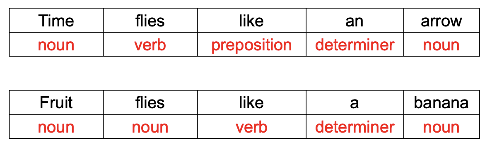
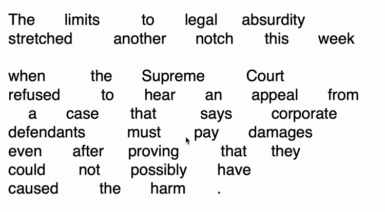

# Lecture 5 Part of Speech Tagging

<h2 id="POS"> Part of Speech(POS)</h2>

* Also called word classes, morphological classes, syntactic categories

* E.g.: nouns, verbs, adjective

* POS tells information about a word and its neighbors:
    * Nouns are often preceded by determiners
    * Verbs preceded by nouns
    * content as a noun pronounced as /'kɑ:ntent/
    * content as an adjective pronounced as /kən'tent/
    
#### POS application: Information Extraction 

* Given sentence: "Brasilia, the Brazilian capital, was founded in 1960"
* Extract information: 
    * capital(Brazil, Brasilia)
    * founded(Brasilia, 1960)
    
* First step of information extraction is finding all POS tags: 
    * nouns: Brasilia, capital
    * adjective: Brazilian
    * verbs: founded
    * numbers: 1960
    
### POS Open Class

* Open vs. closed: How readily do POS categories take on new words?
* E.g. of open classes:
    * Nouns:
        * Proper(专有名词) vs. common(普通名词): Australia, wombat
        * Mass(集合名词) vs. count(可数名词): rice, bowls
    * Verbs:
        * Rich inflection: go/goes/going/gone/went
        * Auxiliary verbs(助动词): be, have, do
        * Transitivity: wait, hit, give
    * Adjectives:
        * Gradable(等级形容词) vs. non-gradable(非等级形容词): happy/happier/happiest, computational
    * Adverbs:
        * Manner(情状副词): slowly
        * Locative(处所副词): here
        * Degree(程度副词): really
        * Temporal(时间副词): today
    
* E.g. of closed classes:
    * Prepositions(介词):
        * in, on, with, for, of, over
    * Particles:
        * off
    * Determiners(限定词):
        * Articles(冠词): a, an, the
        * Demonstratives(指示词): this, that, these, those
        * Quantifiers(数量词): each, every, some, two
    * Pronouns(代词):
        * Personal(人称代词): I, me, she
        * Possessive(所有格代词): my, our
        * Interrogative(疑问代词): who, what
    * Conjunctions(连词):
        * Coordinating(并列连词): and, or, but
        * Subordinating(从属连词): if, although, that
    * Modal verbs(情态动词):
        * Ability: can, could
        * Permission: can, may
        * Possibility: may, might, could, will
        * Necessity: must
    
### Problem of word classes: Ambiguity

* Many word types belong to multiple classes
* POS depends on context
* E.g.: flies
    > 
    * The word flies in the first sentence is an inflection of the verb "fly"
    * The word flies in the second sentence is the plural form of the noun "fly"

<h2 id="tagsets">Tagsets</h2>

### Tagsets

* A compact representation of POS information
    * Usually less than 4 capitalized characters. E.g. NN = noun
    * Often includes inflectional distinctions
    
* Major English tagsets:    
    * Brown: 87 tags
    * Penn Treebank: 45 tags
    * CLAWS/BNC: 61 tags
    * Universal: 12 tags
    
* At least one tagset for all major languages

### Penn Treebank Tags:
* Open classes:
    * NN: noun
    * VB: verb
    * JJ: adjective
    * RB: adverb
    
* Closed classes:
    * DT: determiner
    * CD: cardinal number
    * IN: preposition
    * PRP: personal pronoun
    * MD: modal
    * CC: coordinating conjunction
    * RP: particle
    * WH: wh-pronoun
    * TO: to
    
### Derived Tags:
* Open classes:
    * NN (noun singular):
        * NNS (plural)
        * NNP (proper)
        * NNPS (proper plural)
    * VB (verb infinitive):
        * VBP (1st/2nd person present)
        * VBZ (3rd person singular)
        * VBD (past tense)
        * VBG (gerund)
        * VBN (past participle)
    * JJ (adjective):
        * JJR (comparative)
        * JJS (superlative)
    * RB (adverb):
        * RBR (comparative)
        * RBS (superlative)
    
* Closed classes:
    * PRP (pronoun personal):
        * PRP$ (possessive)
    * WP (wh-pronoun):
        * WP$ (possessive)
        * WDT (wh-determiner)
        * WRB (wh-adverb)
    
### Tagged Text Example
> 

<h2 id="auto_tag">Automatic Tagging</h2>

### Reasons for automatic POS tagging

* Important for morphological analysis. E.g. lemmatization
* For some applications, we want to focus on certain POS
    * E.g. nouns are important for information retreieval, adjectives for sentiment analysis
* Very useful features for certain classification tasks.
    * E.g. genre attribution
    
* POS tags can offer word sense disambiguation
    * E.g. cross/NN, cross/VB, cross/JJ all have different means
    
* Can use them to create larger structures

### Automatic Taggers

* Rule-based taggers
* Statistical taggers
    * Unigram tagger
    * Classifier-based tagger
    * Hidden Markov Model tagger
    
<h3 id='rule-based'>Rule-Based Tagging</h3>

* Typically starts with a list of possible tags for each word. Source from a lexical resource or a corpus
* Often includes other lexcial information. E.g. verb subcategorization
* Apply rules to narrow down to a single tag
* Large systems have thousands of constraints

<h3 id='unigram-tagger'>Unigram Tagger</h3>

* Assign most common tag to each word type
* Requires a corpus of tagged words
* Just a look-up table
* Approximately 90% accuracy
* Often considered the baseline for more complex approaches

<h3 id='classifier-based'>Classifier-Based Tagging </h3>

* Use a standard discriminative classifier like logistic regression or neural network with features:
    * Target word
    * Lexical context around the word
    * Already classified tags in the sentence
    
* Can suffer from error propagation: wrong predictions from previous steps affect the next ones

<h3 id="hmm-tagger">Hidden Markov Models</h3>

* A basic sequential model
* Like sequential classifiers, use both previous tag and lexical evident
* Unlike classifiers, considers all possibilities of previous tag and treat previous tag evidence and lexical evidence as independent from each other
    * Less sparsity
    * Fast algorithms for sequential prediction
    
### Unknown Words

* Huge problem in morphologically rich languages
* Can use things already seen only once to best guess for things never seen before
    * Tend to be nouns, followed by verbs
    * Unlikely to be determiners
    
* Can use sub-word representations to capture morphology