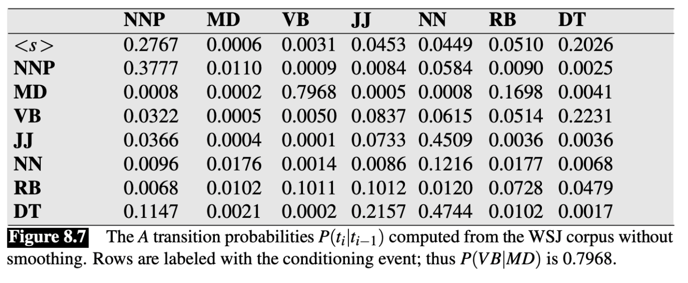

# Lecture 6 Sequence Tagging: Hidden Markov Models

### Problems with POS Tagging

* Exponentially many combinations: |Tags|<sup>M</sup>, for length M

* Tag sequences of different lengths

* Tagging is a sentence-level task but as humans we decompose it into small word-level tasks

* Solution:
    * Define a model that decomposes process into individual word-level tasks steps. But this takes into account the whole sequence when learning and predicting.
    * This is called sequence labelling, or structured prediction
    
### Probabilistic Model of HMM

* Goal: Obtain best tag sequence <b>t</b> from sentence <b>w</b>
    > The formulation: <br>
    > Applying Bayes Rule: <br>
    > Decomposing the Elements:<br>
    >> Probability of a word depends only on the tag: <br>
    >> Probability of a tag depends only on the previous tag: 

### Two Assumptions of HMM

* Output independence: An observed event(word) depends only on the hidden state(tag) -> 

* Markov assumption: The current state(tag) depends only on the previous state -> 

### Training HMM

* Parameters are individual probabilities:
    * Emission Probabilities (O): 
    * Transition Probabilities (A): 
    
* Training uses Maximum Likelihood Estimation: Done by simply counting word frequencies according to their tags.

* E.g.
    * 
    
    * 
  
* The tag for the first word:
    * Assume there is a `<s>` symbol at the start of the sentence
    * E.g. ) = \frac{count(<s>, NN)}{count(<s>)}" alt="">
    
* Unseen `(word, tag)` and `(tag, previous_tag) ` combinations: Applying smoothing techniques

* Output:
    * Transition Matrix: 
    > 
    
    * Emission(Observation) Matrix:
    > 
  
### Making Predictions using HMM (Decoding)


* Simple idea: For each word, take the tag that maximizes . Do it left-to-right greedily
  
* However this is wrong. The goal is to find , not individual  terms.
  
* Correct way: Consider all possible tag combinations, evaluate them, take the max.

### Viterbi Algorithm

* Use Dynamic Programming.
    * We can still proceed sequentially but need to be careful. 
    
* POS tag: `can play`
    
* Best tag for `can` is: )" alt="">
    
* Suppose best tag for `can` is `NN`. To get the tag for `play`, we can take , but this is wrong
    
* Instead, we keep track of <b>scores for each tag</b> for `can` and check them with the different tags for `play`

* E.g.
  > 
  
* Complexity: O(T<sup>2</sup>N), where `T` is the size of the tagset, and `N` is the length of the sequence.
  * `T * N` matrix, each cell performs T operations
  
* Viterbi Algorithm works because of the independence assumptions that decompose the problem

* PsuedoCode:
```python
alpha = np.zeros(M, T)
for t in range(T):
    alpha[1, t] = pi[t] * O[w[1], t]

for i in range(2, M):
    for t_i in range(T):
        for t_last in range(T):
            s = alpha[i-1, t_last] * A[t_last, t_i]
            if s > alpha[i, t_i]:
                alpha[i, t_i] = s
                back[i, t_i] = t_last
best = np.max(alpha[M-1, :])
return backtrace(best, back)
```

* Good practices:
  * Work with log probabilities to prevent underflow
  * Vectorization (User matrix-vector operations)
  
### HMMs in Practice

* Examples previously are based on bigrams called first order HMM

* State-of-the-art model use tag trigams called second order HMM
  * 
  * Viterbi is now O(T<sup>3</sup>N)
  
* Need to deal with sparsity: Some tag trigram sequences might not be present in training data
  * Use interpolation: 
  
  * where 
  
* With additional features, HMM model can reach 96.5% accuracy on Penn Treebank

### Generative vs. Discriminative Taggers

* HMM is generative: 
  
  * Training HMM can generate data (sentences)
  * Allows for unsupervised HMMs: Learn model without any tagged data
  
* Discriminative models describe  directly
  * 
  
  * Supports richer feature set, generally better accuracy when trained over large supervised datasets: 
  
  * E.g. Maximum Entropy Markov Model (MEMM), Conditional Random Field (CRF)
  
  * Most deep learning models of sequences are discriminative