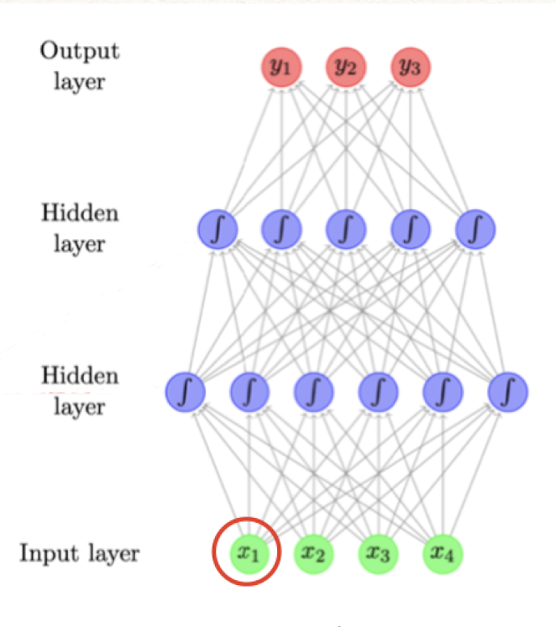
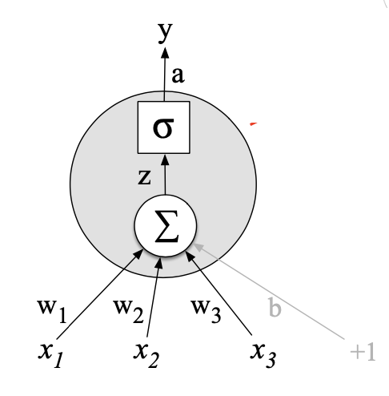
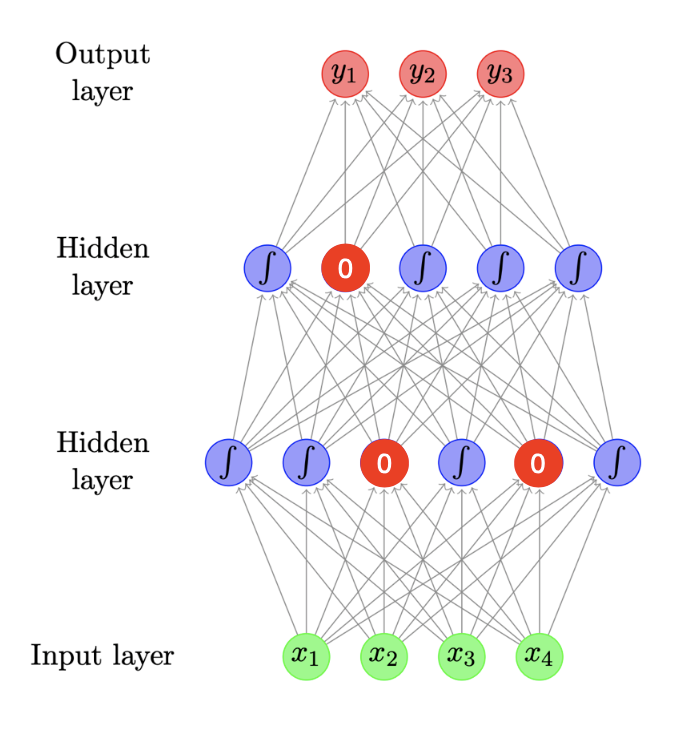
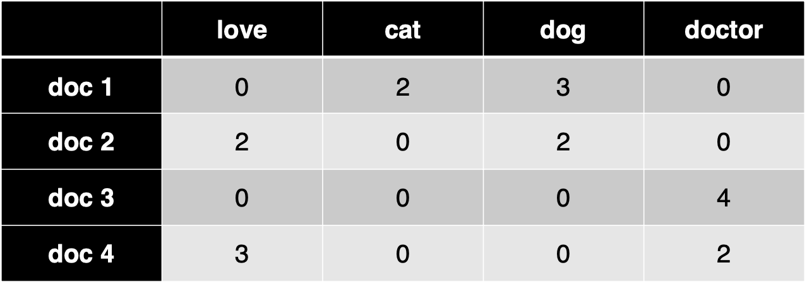
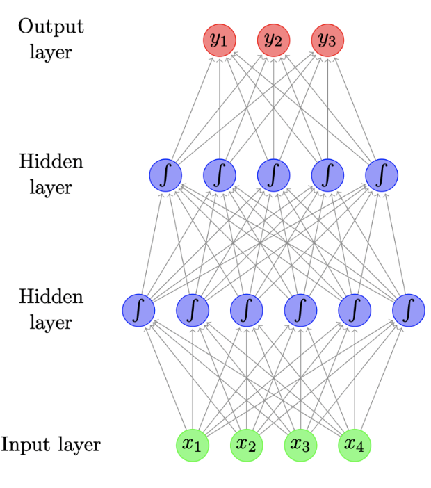
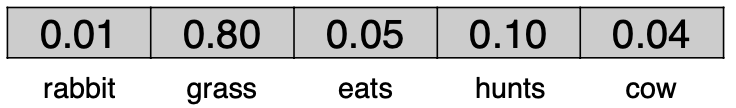
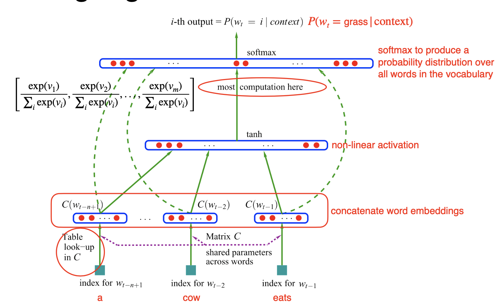
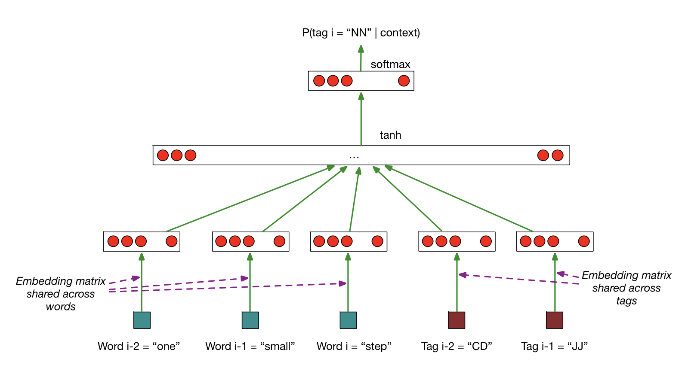

# Lecture 7 Deep Learning for NLP: Feedforward Networks

<h2 id="NN_basics"> Feedforward Neural Networks Basics</h2>

### Deep Learning

* A branch of machine learning

* Re-branded name for neural networks

* Deep: Many layers are chained together in modern deep learning models

* Neural Networks: Historically inspired by the way computation works in the brain
    * Consists of computation units called neurons
    
### Feedforward Neural Network

* Also called multilayer perceptron
* E.g. of architecture:
    > 
  
* Each arrow carries a weight, reflecting its importance
* Certain layers have non-linear activation functions

### Neuron

* Each neuron is a function:
    * Given input `x`, compute real-value `h`: 
    
    >  
    > 
  
    * Scales input (with weights, `w`) and adds offset (bias, `b`)
    * Applies non-linear function, such as logistic sigmoid, hyperbolic sigmoid(tanh), or rectified linear unit
    * `w` and `b` are parameters of the model
    
* Typically hava several hidden units. E.g. 
  
    * Each with its own weights wi, and bias terms bi
      
    * Can be expressed using matrix and vector operators: 
    
    * Where  is a matrix comprising the weight vectors and  is a vector of all bias terms
    
    * Non-linear function applied element-wise
    
### Output Layer

* For binary classification problem: Sigmoid Activation Function

* Multi-class classification problem: Softmax Activation Function ensures probabilities are greater than 0 and sum to 1: 

### Optimization

* Consider how well the model fits the training data, in terms of the probability it assigns to the correct output
  
    * 
    
    * Want to maximize total probability `L`
    
    * Equivalently minimize `-log L` with respect to parameters
    
* Trained using gradient descent
    * Tools like <i>tensorflow</i>, <i>pytorch</i>, <i>dynet</i> use autodiff to compute gradients automatically
    
### Regularization

* Have many parameters, so the model overfits easily

* Low bias, high variance

* Regularization is very import in neural networks

* L1-norm: sum of absolute values of all parameters

* L2-norm: sum of squares of all parameters

* Dropout: randomly zero-out some neurons of a layer
    * If a dropout rate = 0.1, a random 10% of neurons now have 0 values
    > 
    * Can apply dropout to any layer, but in practice, mostly to the hidden layers
  
<h2 id="fnn_application">Applications in NLP</h2>

### Topic Classification

* Given a document, classify it into a predefined set of topics. E.g. economy, politics, sports

* Input: Bag-of-words 
  > Example input: 
  > 
  
* Training: 
  > Architecture: 
  >  
  > Hidden Layers: 
  >  
  >  
  >  
  
  * Randomly initialize `W` and `b`
  * E.g:
    > Input:  
    > Output: : Probability distribution over  
    > Loss:  if true label is  
  
* Prediction:
  * E.g. 
    > Input:  
    > Output:  
    > Predicted class is  

* Potential Improvements:
  * Use Bag of bigrams as input
  * Preprocess text to lemmatize words and remove stopwords
  * Instead of raw counts, can weight words using TF-IDF or indicators

### Language Model as Classifiers

* Language Models can be considered simple classifiers. 
  * E.g. For a trigram model:  classifies the likely next word in a sequence, given `salt` and `and`
  
* Feedforward Neural Network Language Model
  * Use neural network as a classifier to model
  * Input features: The previous words
  * Output classes: the next word
  * Use Word Embeddings to represent each word
    * E.g. of Word Embeddings: 
      > 
      
### Word Embeddings

* Maps discrete word symbols to continuous vectors in a relatively low dimensional space

* Word embeddings allow the model to capture similarity between words

* In feed-forward neural network language model, the first layer is the sum of input word embeddings

### Training a Feed-Forward Neural Network Language Model

* E.g. 

* Lookup word embeddings () for `a`, `cow`, and `eats`

* Concatenate them and feed it to the network: 
  * 
  
  * 
  
  * 
  
*  gives the probability distribution over all words in the vocabulary
  * E.g. 
  >  
  > 

* Loss: 

* Most parameters are in the word embeddings W1 (size = d * |V|) and the output embeddings W3 (size = |V| * d)

* Example Architecture: 
  >  
  
* Problem of Count-based N-gram models:
  * Cheap to train
  * Problems with sparsity and scaling to larger contexts
  * Don't adequately capture properties of words
  
* Advantages of Feed-Forward Neural Network Language Model:
  * Automatically capture word properties, leading to more robust estimates
  
### Feed-Forward Neural Network for POS Tagging

* POS tagging can also be framed as classification:
  *  -> classifies the likely POS tag for `eats`
  
* Feed-Forward Neural Network Language Model architecture can be adapted to the task directly

* Inputs:
  * recent words: 
  * recent tags: 
  
* Outputs:
  * current tags: 
  
* Frame as neural network with:
  * 5 inputs: 3 word embeddings and 2 tag embeddings
  * 1 output: vector of size |T|, using softmax
  
* Training to minimize: 

* Example Architecture:
  >  