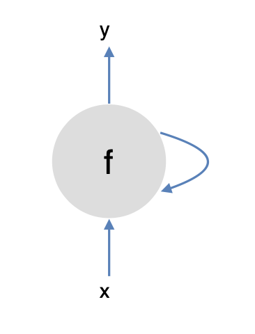
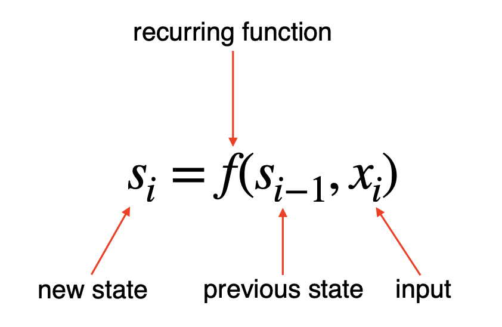
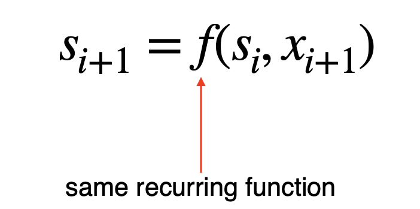
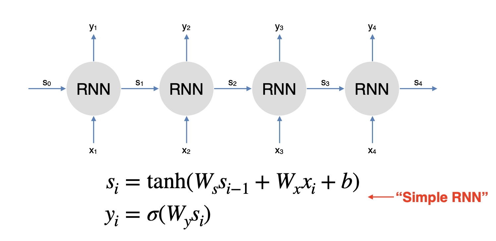
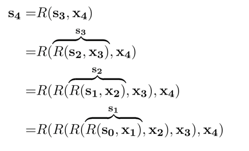
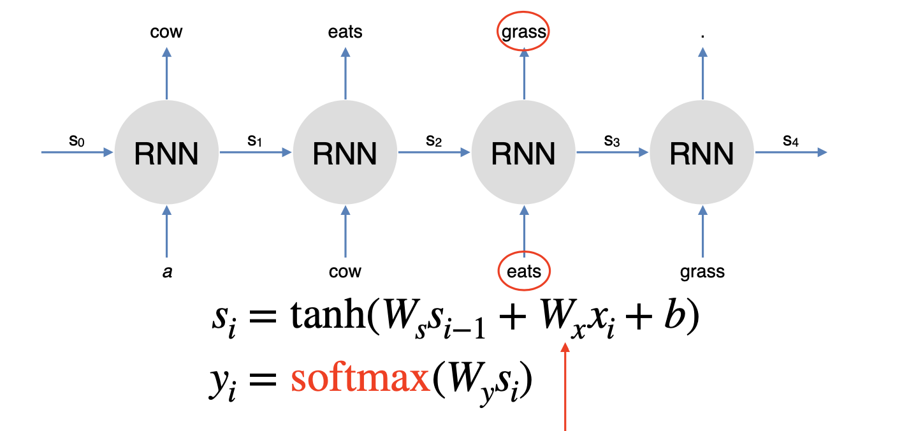
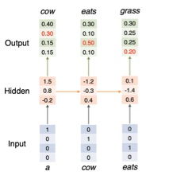
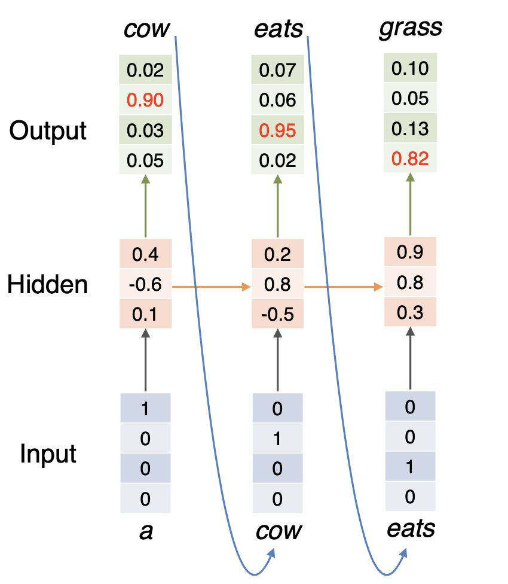

# Lecture 8 Deep Learning for NLP: Recurrent Networks

<h2 id="rnn">Recurrent Networks</h2>

### Problem of N-gram Language Model

* Cen be implemented using counts with smoothing

* Can be implemented using feed-forward neural networks

* Problem: limited context

* E.g. Generate sentences using trigram model:
 > 

### Recurrent Neural Network(RNN)

* Allow representation of arbitrarily sized inputs

* Core idea: processes the input sequence one at a time, by applying a recurrence formula

* Uses a state vector to represent contexts that have been previously processed

* RNN Neuron:
    > 
  
* RNN States:
    >  
    >  
    > Activation:  
    
* RNN Unrolled:
    > 
  
  * Same parameters  are used across all time steps

* Training RNN:
    * An unrolled RNN is a very deep neural network. But parameters are shared across all time steps
    * To train RNN, just need to create the unrolled computation graph given an input sequence and use backpropagation algorithm to compute gradients as usual.
    * This procedure is called backpropagation through time. 
        > E.g of unrolled equation: 
        >  
      
### RNN Language Model:

*  is current word (e.g. `eats`) mapped to an embedding
  
*  contains information of the previous words (e.g. `a` and `cow`)
  
*  is the next word (e.g. `grass`)

* Training: 
    * Vocabulary: `[a, cow, eats, grass]`
    * Training example: `a cow eats grass`
    * Training process:
      >  
      >  
      > 
      
    * Losses:
        * 
          
        * 
          
        * 
          
        * Total loss: 
    
* Generation:
  > 