# Lecture 8 Deep Learning for NLP: Recurrent Networks

<h2 id="rnn">Recurrent Networks</h2>

### Problem of N-gram Language Model

* Cen be implemented using counts with smoothing

* Can be implemented using feed-forward neural networks

* Problem: limited context

* E.g. Generate sentences using trigram model:
 > 

### Recurrent Neural Network(RNN)

* Allow representation of arbitrarily sized inputs

* Core idea: processes the input sequence one at a time, by applying a recurrence formula

* Uses a state vector to represent contexts that have been previously processed

* RNN Neuron:
    > 
  
* RNN States:
    >  
    >  
    > Activation:  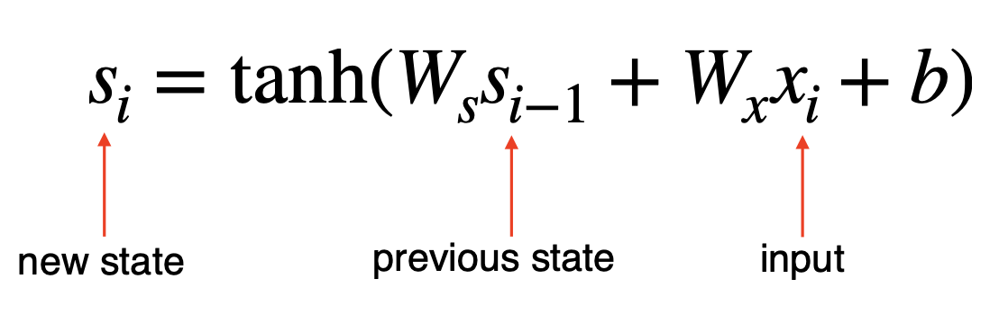 
    
* RNN Unrolled:
    > 
  
  * Same parameters  are used across all time steps

* Training RNN:
    * An unrolled RNN is a very deep neural network. But parameters are shared across all time steps
    * To train RNN, just need to create the unrolled computation graph given an input sequence and use backpropagation algorithm to compute gradients as usual.
    * This procedure is called backpropagation through time. 
        > E.g of unrolled equation: 
        >  
      
### RNN Language Model:

*  is current word (e.g. `eats`) mapped to an embedding
  
*  contains information of the previous words (e.g. `a` and `cow`)
  
*  is the next word (e.g. `grass`)

* Training: 
    * Vocabulary: `[a, cow, eats, grass]`
    * Training example: `a cow eats grass`
    * Training process:
      >  
      >  
      > 
      
    * Losses:
        * 
          
        * 
          
        * 
          
        * Total loss: 
    
* Generation:
  > 
  
* Problems of RNN:
    * Error Propagation: Unable to recover from errors in intermediate steps
    * Low diversity in generated language
    * Tend to generate bland or generic language
    
<h2 id="LSTM">Long Short-Term Memory Networks</h2>

### Long Short-Term Memory Model (LSTM)

* RNN has the capability to model infinite context. But it cannot capture long-range dependencies in practice due to the vanishing gradients

* Vanishing Gradient: Gradients in later steps diminish quickly during backpropagation. Earlier inputs do not get much update.

* LSTM is introduced to solve vanishing gradients

* Core idea: have memory cells that preserve gradients across time. Access to the memory cells is controlled by gates.

* Gates: For each input, a gate decides:
    * How much the new input should be written to the memory cell
    * How much content of the current memory cell should be forgotten
    
* Comparison between simple RNN and LSTM:
    > 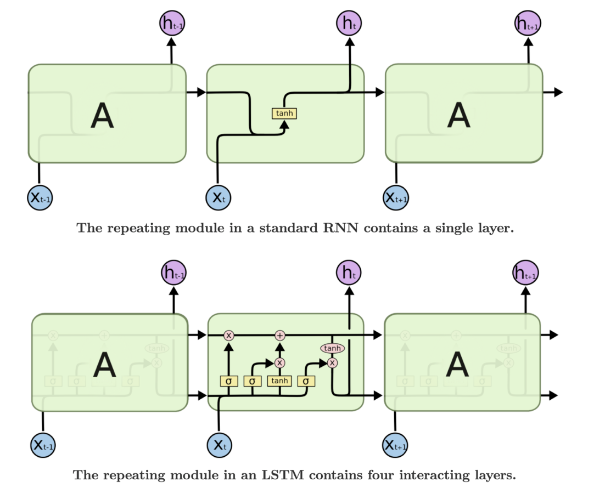
    
### Gating Vector

* A gate  is a vector. Each element of the gate has values between 0 and 1. Use sigmoid function to produce .

*  is multiplied component-wise with vector  to determine how much information to keep for 
    > 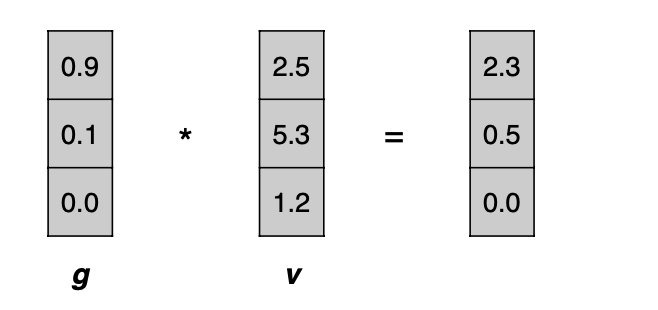

### Forget Gate

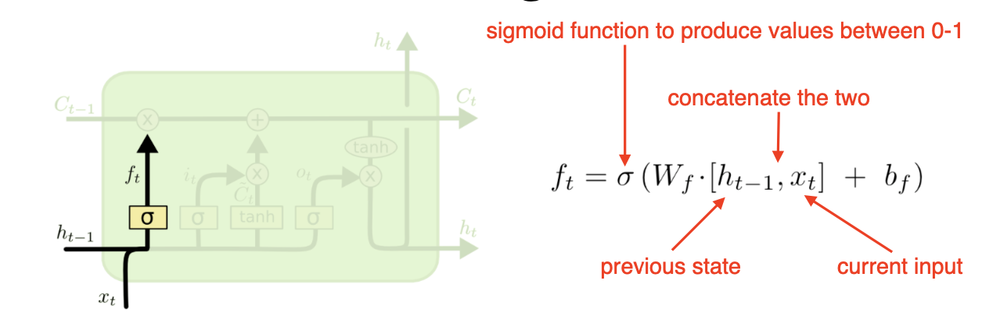
  
* Controls how much information to forget in the memory cell 

* E.g. Given `Tha cas that the boy` predict the next word `likes`
    * Memory cell was storing noun information `cats`
    * The cell should now forget `cats` and store `boy` to correctly predict the singular verb `likes`
    
### Input Gate

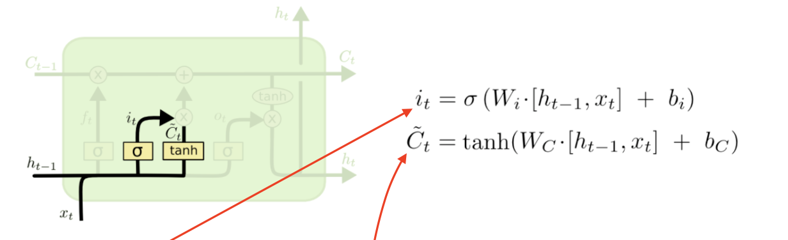

* Input gate controls how much new information to put to memory cell

*  is new distilled information to be added

### Update Memory Cell

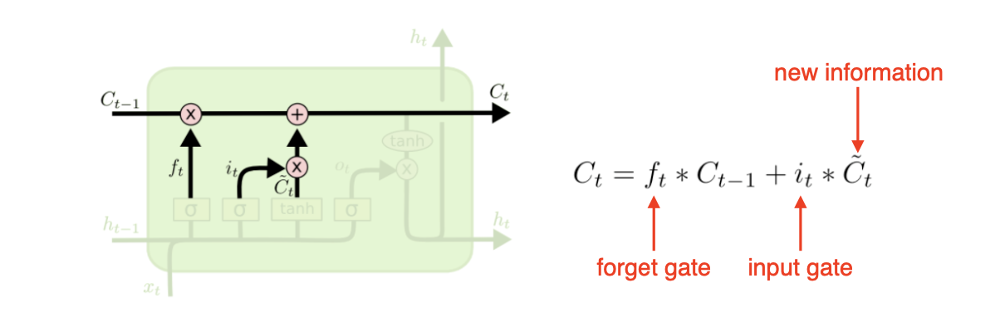

* Use the forget and input gates to update memory cell

### Output Gate

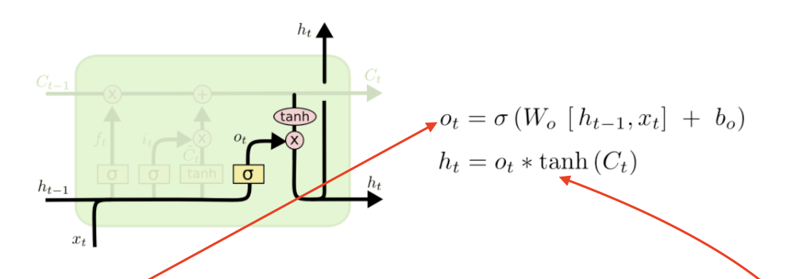

* Output gate controls how much to distill the content of the memory cell to create the next state

### Disadvantages of LSTM

* Introduces some but not many parameters
* Still unable to capture very long range dependencies
* Slower but not much slower than simple RNN

<h2 id="LSTM_application">Applications of RNN</h2>

### Example Applications

* Shakespeare Generator:
    * Training data: all works fo Shakespeare
    * Model: Character RNN, hidden dimension = 512
    
* Wikipedia Generator:
    * Training data: 100MB of Wikipedia raw data
    
* Code Generator

* Text Classification
    * RNNs can be used in variety NLP tasks. Particularly suited for tasks where order of words matter. E.g. sentiment analysis
    > 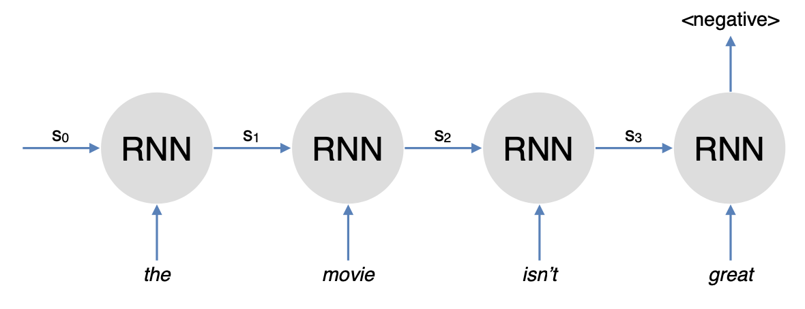
    
* Sequence Labeling: E.g. POS tagging
    > 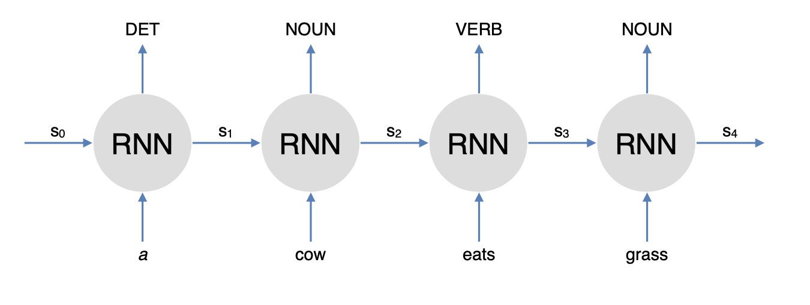
  
### Variants of LSTM

* Peephole connections: allow gates to look at cell state
    > 
  
* Gated recurrent unit (GRU): Simplified variant with only 2 gates and no memory cell
    > 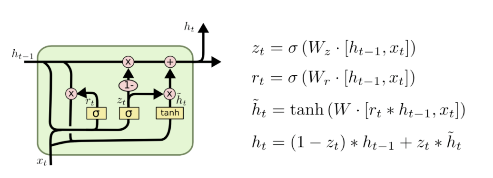
  
* Multi-layer LSTM
    > 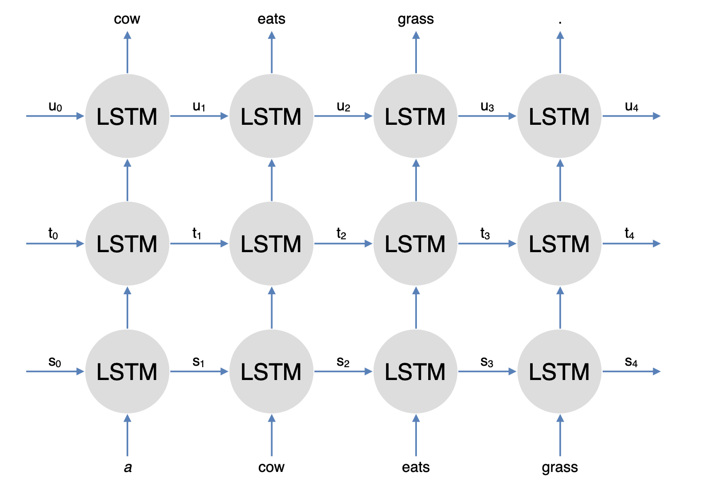
  
* Bidirectional LSTM
    > 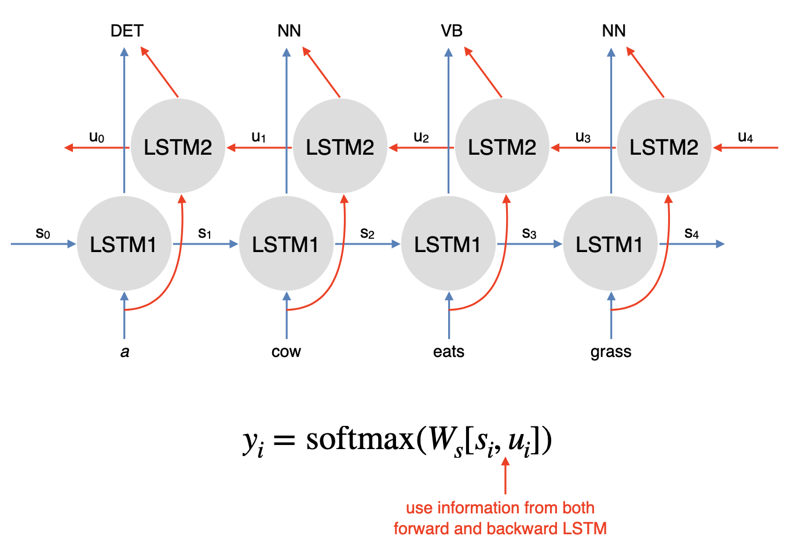