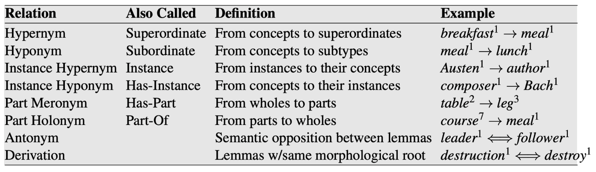
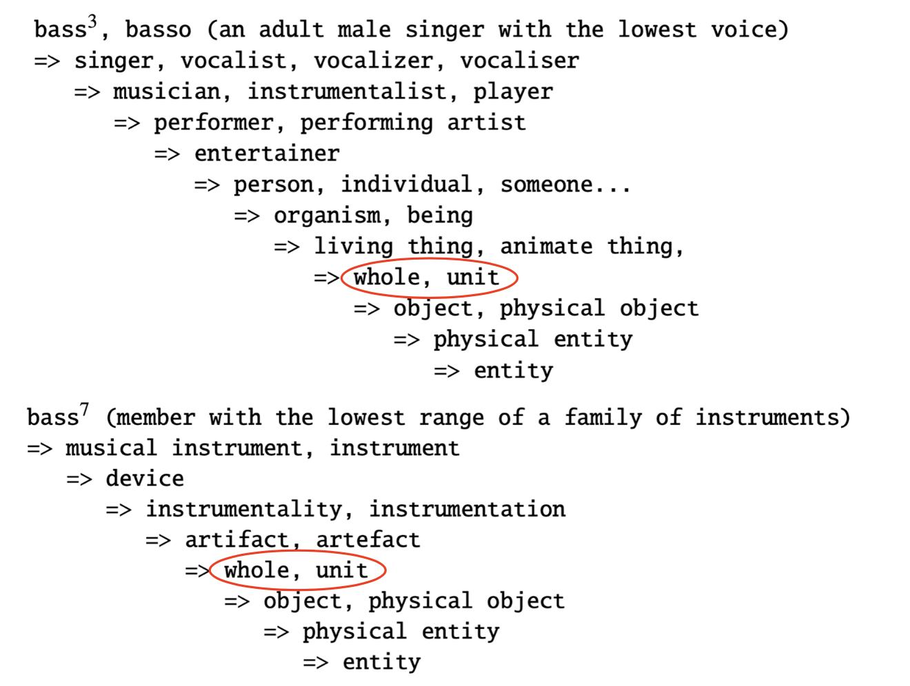
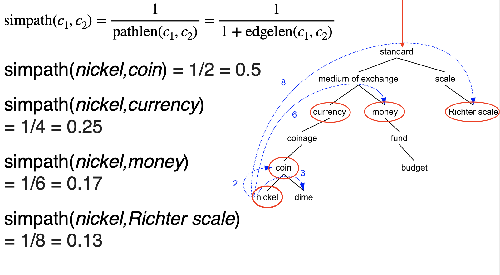
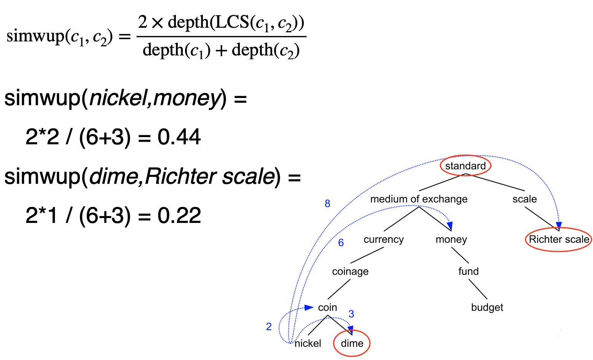
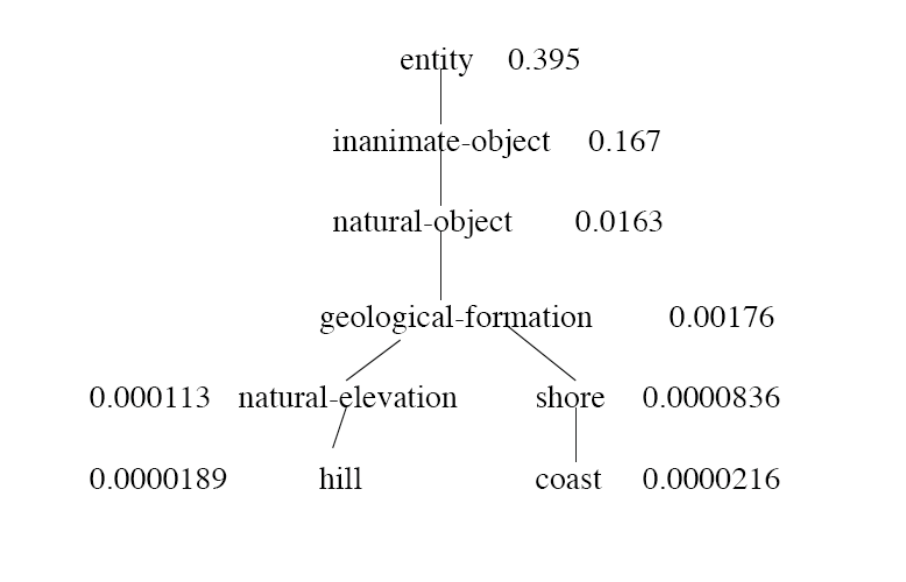
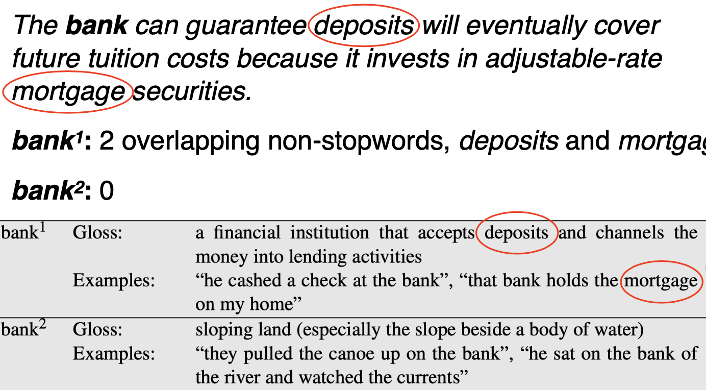

# Lecture 9 Lexical Semantics

### Introduction: sentiment analysis

* Bag-of-words, KNN classifier. Training data:
    * `This is a good movie` -> `positive`
    * `This is a great movie` -> `positive`
    * `This is a terrible film` -> `negative`
    * `This is a wonderful film` -> ?
    
* Two problems here:
    * The model does not know that `movie` and `film` are synonyms. Since `film` appears only in negative examples, the model learns that it is a negative word.
    * `wonderful` is not in the vocabulary (OOV: Out-Of-Vocabulary)
    
* Comparing words directly will not work. How to make sure we compare word meanings?

* Solution: Add this information explicitly through a lexical database

<h2 id="lexical_semantics"> Lexical Database</h2>

### Word Semantics

* Lexical Semantics:
    * How th meanings of words connect to one another
    * Manually constructed resources
    
* Distributional Semantics:
    * How words relate to each other in the text
    * Automatically created resources from corpora
    
### Word meanings

* Dictionary definition:
    * Dictionary definitions are necessarily circular
    * Only useful if meaning is already understood
    * E.g
        > red: n. the color of blood or a ruby 
        > blood: n. the red liquid that circulates in the heart, arteries, and veins of animals 
        > Here the word `red` is described by `blood` and `blood` is described by `red`. Therefore, to understand `red` and `blood` both meaning has to be understood

* Their relationships with other words.
    * Also circular, but better for text analysis
    
* Word sense: A word sense describes one aspect of the meaning of a word
    * E.g. mouse: a quiet animal like a mouse

* Polysemous: If a word has multiple senses, it is polysemous.
    * E.g. 
        * mouse1: a mouse controlling a computer system in 1968
        * mouse2: a quiet animal like a mouse
    
* Gloss: Textual definition of a sense, given by a dictionary 

* Meaning Through Relations:
    * Synonymy(同义): near identical meaning
        * vomit - throw up
        * big - large
    * Antonymy(反义): opposite meaning
        * long - short
        * big - little
    * Hypernymy(上位关系): is-a relation
        * cat - animal
        * mango - fruit
    * Meronymy(部分-整体关系): part-whole relation
        * leg - chair
        * whel - car
    
### WordNet

* A database of lexical relations

* English WordNet includes ~120,000 nouns, ~12,000 verbs, ~21,000 adjectives, ~4,000 adverbs

* On average: noun has 1.23 senses, verbs 2.16

### Synsets

* Nodes of WordNet are not words or lemmas, but senses

* There are represented by sets of synonyms, or called synsets

* E.g. Bass:
    * {bass, deep}
    * {bass, bass voice, basso}
    
### Noun Relations in WordNet

### Hypernymy Chain

<h2 id="word_similarity">Word Similarity</h2>

### Word Similarity

* Synonymy: file - movie

* What about show - file and opera - film?

* Unlike synonymy which is a binary relation, word similarity is a spectrum

* Use lexical database or thesaurus(分类词词典) to estimate word similarity

### Word Similarity with Paths

* Given WordNet, find similarity based on path length

* pathlen(c1, c2) = 1 + edge length in the shortest path between sense c1 and c2

* Similarity between two senses:
    > 
  
* Similarity between two words:
    > 
  
* E.g. 
    > 
  
### Beyond Path Length

* Problem of simple path length: Edges vary widely in actual semantic distance
    * E.g. from last example tree:
        * simpath(nickel, money) = 0.17
        * simpath(nickel, Richter scale) = 0.13
        * From the simple path length, similarity of `nickel-money` and `nickel-Richter scale` are very close. But in actual meanings nickel is much similar to money then Richter scale
    
* Solution 1: include depth information
    * Use path to find lowest common subsumer (LCS)
    * Compare using depths:
        >  
        > High simwup when parent is deep or senses are shallow
      
    * E.g.
        > 
      
### Abstract Nodes

* Node depth is still poor semantic distance metric. E.g.:
    * simwup(nickel, money) = 0.44
    * simwup(nickel, Richter scale) = 0.22
    
* Node high in the hierarchy is very abstract or general

### Concept Probability of A Node

* Intuition:
    * general node -> high concept probability
    * narrow node -> low concept probability
    
* Find all the children of the node, and sum up their unigram probabilities:  
  
    * child(c): synsets that are children of c
    
* E.g.
    >  
    > Abstract nodes in the higher hierarchy has a higher P(c)
  
### Similarity with Information Content

* Information Content:  
    * general concept = small values
    * narrow concept = large values
* simlin :  
    * High simlin when concept of parent is narrow or concept of senses are general
    
* E.g 
    >  

<h2 id="word_sense_disambiguation">Word Sense Disambiguation</h2>

### Word Sense Disambiguation

* Task: Selects the correct sense for words in a sentence
* Baseline: Assume the most popular sense
* Good WSD potentially useful for many tasks:
    * Knowing which sense of mouse is used in a sentence is important
    * Less popular nowadays because sense information is implicitly captured by contextual representations
    
### Supervised WSD

* Apply standard machine classifiers
* Feature vectors are typically words and syntax around target
* Requires sense-tagged corpora
    * E.g. SENSEVAL, SEMCOR
    * Very time-consuming to create

### Unsupervised WSD: Lesk

* Lesk: Choose sense whose WordNet gloss overlaps most with the context

* E.g. 
    >  
  
### Unsupervised WSD: Clustering

* Gather usages of the word
* Perform clustering on context words to learn the different senses
    * Rationale: context words of the same sense should be similar
    
* Disadvantages:
    * Sense cluster not very interpretable
    * Need to align with dictionary senses